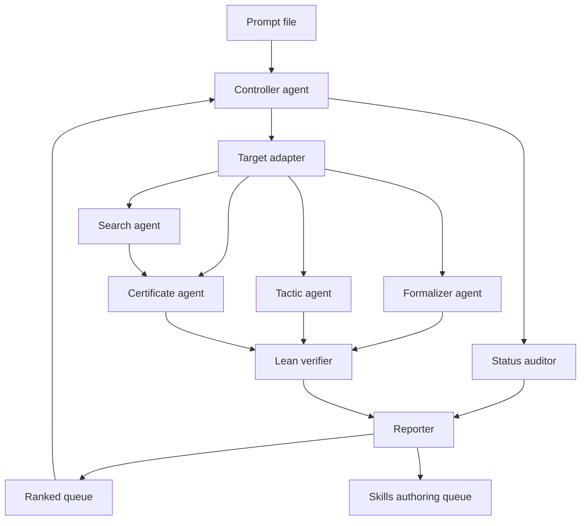

# Multi-Agent Research Pipeline Prompt

Use this file as the run prompt for a multi-agent GrokRxiv run, a multi-agent
Codex-harness research run, or a research-skills authoring pipeline.

The file has two layers:

1. The universal research contract defines what counts as trustworthy output.
2. The multi-agent execution contract defines which specialist agent owns each
   part of the work.
3. Target adapters define where candidate problems come from and how each
   problem family should be attacked.

When an adapter conflicts with the universal contract, the universal contract
wins. Search, ranking, LLM reasoning, Haskell programs, SAT solvers, SMT solvers,
and numerical experiments are exploratory until their final claim is checked by
Lean 4 or another explicitly trusted verifier.

## Run Stanza

```text
/goal
Run a trustworthy multi-agent open-problem attack pipeline over the selected
mathematical problem family. The primary goal is to prove the full open problem
for each ranked lane. Report failure unless the complete open-problem statement
is proved by Lean 4 or another explicitly trusted verifier.

Bounded instances, toy cases, finite witnesses, reusable checkers, Haskell
searches, status audits, dependency maps, missing-API reports, and PR-ready
patches are valuable partial progress. They do not satisfy the lane's success
condition unless they prove the full open problem.

Never claim an open problem is solved unless the complete proof or certificate
for the open statement is checked by Lean 4 or another explicitly trusted
verifier.

/inputs
adapter_id: controller | formal_conjectures | erdos_miner |
  equational_theories | cerny_automata | ramsey_graph_coloring |
  schur_rado | hadwiger_nelson | union_closed | latin_squares |
  hadamard | busy_beaver | graceful_trees | dedekind |
  erdos_straus | andrews_curtis | modular_diophantine |
  additive_combinatorics | finite_quantum | haskell_lean_framework

queue_id: final_ranked_12
mode: audit | proof | checker | search | skills | full_loop
search_loop: off | funsearch
proposer_models: claude,gpt-5,gemini
budget: explicit time, token, theorem-count, candidate-count, or search bound
workspace: target directory for generated artifacts

/plan
1. Load this universal contract.
2. If adapter_id is controller, score all adapters and select the next job.
3. Otherwise load the named adapter.
4. Create or update the run ledger.
5. Run the adapter through the universal trust gates.
6. Stop only after proving the full open problem or producing a precise
   failure-to-solve report with any partial artifacts clearly labeled.

/loop
For each selected target:
1. Audit current status.
2. Normalize the statement.
3. Choose the smallest useful formal target.
4. Separate untrusted exploration from trusted verification.
5. Attempt proof, search, certificate generation, or status audit.
6. Verify final claims where possible.
7. Classify the result as `open-problem-solved` only if the full open statement
   is verified; otherwise classify it as failure/partial progress.
8. Write artifacts and update the queue.
```

## Architecture



## Multi-Agent Execution Contract

This pipeline is explicitly multi-agent. A controller agent owns scheduling and
state; specialist agents own bounded subtasks; the Lean verifier agent owns the
trusted lane. No search, status, tactic, or reporting agent may upgrade a result
to a mathematical claim without the verifier agent's evidence.

Required agent topology:

```text
controller
  -> status_auditor
  -> adapter_agent
      -> formalizer_agent
      -> tactic_agent
      -> search_agent
      -> certificate_agent
      -> lean_verifier_agent
      -> skills_authoring_agent
  -> reporter_agent
```

Execution rules:

- The controller may run independent status/search subtasks in parallel, but
  Lean builds and trusted certificate checks run through the verifier lane.
- Each specialist agent receives a bounded prompt, an artifact path, and a
  required classification label.
- Specialist agents write findings to files; they do not rely on chat memory.
- The reporter agent consolidates outputs only after checking that every claim
  names its trusted or untrusted source.
- A lane is not complete because agents produced text, a toy theorem, or a
  bounded checker. It is solved only when the full open problem is verified.
  Otherwise the lane terminates as `not-solved` with a failure report and any
  partial artifacts.

## Open-Target Lock

Every lane must lock one exact open problem before any proof/search work starts.
The status auditor must write the locked target into `STATUS.md` and the
controller must copy it into `QUEUE.md`.

Required fields:

```text
locked_open_problem:
current_status: open | not-open | unclear
status_sources:
full_success_statement:
toy_or_known_results_that_do_not_count:
```

Rules:

- If `current_status` is `not-open`, the lane must choose another target before
  spending proof/search budget.
- If `current_status` is `unclear`, the lane is `status-audit-only` until the
  status is resolved.
- A known small case, textbook sub-lemma, reusable checker, or bounded search is
  allowed only as partial progress toward the locked open problem.
- A lane cannot be marked solved unless `full_success_statement` is verified.
- Do not replace the locked open problem with an easier artifact after tactics
  or search fail.

## Research-Agent Proposer-Verifier-Fixer Loop

This pipeline reuses the `/research-agent:research-agent` discipline, adapted
from paper review/fix loops to open-problem search:

```text
proposer agents -> candidate JSON -> verifier -> fixer -> leaderboard -> iterate
```

The loop is for search-shaped open targets: improve a bound, find a
construction, find a countermodel, discover a modular-cover identity, or produce
a complete finite certificate. It is not for replacing an open problem with a
toy theorem.

### Required agents

```text
controller
  -> status_auditor
  -> proposer_claude
  -> proposer_gpt5
  -> proposer_gemini
  -> candidate_normalizer
  -> search_agent
  -> lean_or_sat_verifier
  -> fixer_agent
  -> leaderboard_agent
  -> reporter_agent
```

Use the strongest available models at run time. If a named proposer is not
available, mark it `unavailable` in `ITERATION_LOG.md`; do not pretend model
diversity happened.

### Mandatory loop artifacts

Each search-shaped run must create:

```text
PROPOSER_PROMPTS.md     exact prompts sent to each proposer
candidates/*.jsonl     raw and normalized candidate stream
VERIFIER_LOG.md         Lean/SAT/Haskell verifier commands and outcomes
LEADERBOARD.md          best candidates, scores, verifier status, hashes
FIXER_LOG.md            failed candidates, repairs attempted, repair outcomes
ITERATION_LOG.md        round-by-round status, budgets, proposer availability
REPORT.md              strict solved/not-solved result
```

### Candidate JSON contract

Every proposer must emit candidates in this shape:

```json
{
  "candidate_id": "string",
  "lane": "string",
  "locked_open_problem": "string",
  "claim_type": "construction | countermodel | lower_bound | upper_bound | identity | proof_sketch",
  "object": {},
  "parameters": {},
  "claimed_improvement": "string",
  "verification_target": "string",
  "expected_checker": "lean | sat | haskell | external_trusted",
  "proposer": "claude | gpt-5 | gemini | other",
  "notes": "string"
}
```

The normalizer may reject malformed candidates. Rejected candidates still go to
`candidates/rejected.jsonl` with a reason.

### Research-agent hard gates

Borrowed from the local `research-agent` review/fix pattern:

- Fixed rounds: each proposer gets a bounded number of rounds. Default: 3
  proposal rounds plus 2 fixer rounds per promising candidate.
- Mandatory verification: every leaderboard entry must name the verifier command
  and result.
- Regenerate artifacts after fixes: repaired candidates must be re-serialized
  and re-verified; stale verifier logs do not count.
- Respawn or fail: if a proposer returns no valid candidates, respawn once with
  the schema and failure reason; if it fails again, mark that proposer failed.
- No silent skips: missing `PROPOSER_PROMPTS.md`, `VERIFIER_LOG.md`, or
  `LEADERBOARD.md` is a pipeline failure.
- No success by score alone: a candidate only solves the lane if the trusted
  verifier proves the full locked open problem or verifies a complete
  counterexample/certificate.

### Leaderboard scoring

Score candidates by:

```text
trusted_status         verified > verifier_failed > unchecked
open_problem_progress  full_solution > frontier_improvement > bounded_known_case
novelty                new construction/countermodel > known example
certificate_size       smaller is better when trusted status ties
reproducibility        deterministic > heuristic > unavailable
```

The leaderboard may preserve best partial progress, but it may not mark a lane
solved unless `open_problem_solved: true`.

### Recommended first search-shaped targets

1. E677 =>fin E255: search for an order >=4 countermodel or complete finite
   implication proof.
2. Hadamard order 668: search construction parameters with exact verifier
   targets.
3. Schur/Rado/Ramsey: choose a currently open finite bound/value and try to
   improve the verified lower or upper bound.
4. Erdos-Straus: search for modular-cover identities that could form a complete
   verified cover.

## Shared Agent Roles

### Controller agent

Owns target selection and run discipline.

- Reads `QUEUE.md`, `AGENT_STATUS.md`, and the selected adapter.
- Scores targets by formalization clarity, Haskell usefulness, Lean-checker
  simplicity, certificate compactness, mathlib readiness, novelty, and artifact
  value.
- Prefers work that can either prove the full open problem or rapidly falsify
  that the current attempt is sufficient. Finite, bounded, constructive, or
  certificate-friendly subgoals are allowed only as partial-progress steps.
- Rejects targets that depend on vague statements, floating-point evidence only,
  or large theory before any useful artifact.
- Assigns one target at a time to the specialist agents.

### Status auditor

Owns mathematical and literature status.

- Determines whether a target is open, solved, partially solved, solved under
  assumptions, or known only in finite ranges.
- Records canonical statements, known reductions, known datasets, known
  examples, existing formalizations, and current bounds in `STATUS.md`.
- Marks status claims as source-backed, memory-derived, or unchecked.
- Does not make proof claims.

### Formalizer agent

Owns Lean statements and definitions.

- Defines the smallest useful objects, predicates, and theorem statements.
- Uses existing mathlib and repository APIs before inventing new abstractions.
- Adds theorem skeletons only when they compile and clarify the target.
- For `FormalConjecturesForMathlib`, keeps code PR-quality and avoids `sorry`.

### Tactic agent

Owns baseline Lean proof attempts.

- Compiles the statement unchanged.
- Runs a bounded tactic portfolio: `simp`, `aesop`, `omega`, `linarith`,
  `nlinarith`, `ring_nf`, `norm_num`, `fin_cases`, and domain-specific
  rewriting.
- Minimizes successful proofs.
- Records failures as missing lemmas, missing definitions, domain-theory gaps,
  or bad statements.

### Search agent

Owns untrusted computation.

- Uses Haskell, SAT, SMT, brute force, canonicalization, or domain-specific
  enumeration to propose witnesses, countermodels, proof traces, examples, or
  search reports.
- Emits machine-readable certificates under `certs/`.
- Records search bounds, pruning assumptions, canonicalization assumptions, and
  reproducibility commands.

### Certificate agent

Owns certificate shape.

- Designs compact, explicit certificate formats.
- Includes enough data for Lean to check the final claim without trusting the
  search code.
- Includes `problem_type`, `parameters`, `object`, `claim`, `checker_version`,
  `hash`, and `proof_payload` when the generic protocol is used.

### Lean verifier agent

Owns trusted checking.

- Builds or reuses Lean checkers.
- Verifies statements, proofs, witnesses, countermodels, colorings, matrices,
  automata, set systems, labels, modular covers, traces, or move sequences.
- Rejects unsupported claims.
- Reports trusted result status as one of:
  `verified`, `not_verified`, `checker_missing`, `statement_failed_to_compile`,
  `certificate_failed`, or `trusted_verifier_not_available`.

### Skills authoring agent

Owns reusable infrastructure requests.

- Converts repeated gaps into `SKILLS_QUEUE.md` entries.
- Examples: graph-coloring certificate checker, finite magma evaluator,
  automaton reset-word checker, modular-cover verifier, matrix-orthogonality
  checker, set-family closure checker.
- Does not block the current run unless the adapter requires that tool.

### Reporter agent

Owns durable outputs.

- Writes `REPORT.md`, `STATUS.md`, `QUEUE.md`, `RUNLOG.md`, and `NEXT_STEPS.md`.
- Classifies every attempted target.
- Separates verified results from exploratory evidence.
- Gives enough detail for another agent to resume without reading chat history.

## Shared Artifact Layout

Use this layout inside a run directory such as:

```text
research_runs/<adapter_id>/<target_slug>/
```

Required artifacts:

```text
README.md            Problem, exact target, and run summary
STATUS.md            Current mathematical status and sources
QUEUE.md             Ranked target queue and scoring
REPORT.md            Attempt results and classifications
RUNLOG.md            Commands, bounds, attempts, and verifier outcomes
NEXT_STEPS.md        Resumable continuation instructions
```

Conditional artifacts:

```text
lakefile.lean        Lean project scaffold if outside an existing project
Main.lean            Core definitions, statements, proofs, or checkers
Search.hs           Haskell generator, searcher, or certificate emitter
certs/              Machine-readable certificates
candidates/         Candidate JSONL streams for proposer/search loops
PROPOSER_PROMPTS.md Exact prompts sent to Claude/GPT-5/Gemini proposers
VERIFIER_LOG.md     Trusted and untrusted verifier command log
FIXER_LOG.md        Candidate repair attempts and outcomes
LEADERBOARD.md      Candidate scores, trusted status, hashes, and best frontier
ITERATION_LOG.md    Round budgets, proposer availability, and loop state
BAD_STATEMENT.md    Misformalization notes and proposed corrections
SKILLS_QUEUE.md     Reusable missing tools, lemmas, or checkers
PATCH_PLAN.md       PR-ready change plan
TEST_LOG.md         Build, Lean, Haskell, SAT, and checker results
```

## Universal Trust Gates

Every adapter must pass through these gates.

### Gate 1: Status audit

- Verify current mathematical status before making claims.
- Identify canonical statement, known reductions, recent best bounds, known
  datasets, and existing formalizations.
- If status is unknown, classify the target as `status-audit-only`.

### Gate 2: Normalization

- Define objects precisely.
- Identify quantifiers and whether the target is finite, bounded, constructive,
  universal, existential, asymptotic, computational, or statement-only.
- Choose the smallest useful formal target.

### Gate 3: Trust separation

- Haskell, SAT, SMT, LLMs, and search code may generate candidates.
- Lean must verify final mathematical claims whenever possible.
- Numerical evidence is never proof.
- Bounded absence is not a global nonexistence proof unless the enumeration and
  bound are themselves verified or independently trusted.

### Gate 4: Partial artifacts after failure

Each run must attempt the full open problem first. If the full open problem is
not proved, the run must still preserve useful partial artifacts. Partial
artifacts include:

- Lean 4 formalization of a statement.
- Lean 4 proof or proof skeleton.
- Lean checker for finite certificates.
- Haskell search or certificate generator.
- Verified witness, countermodel, coloring, matrix, automaton, labeling, trace,
  modular cover, or computational certificate.
- Status audit and dependency map.
- Missing mathlib API report.
- Bad-statement report.
- PR-ready patch.

### Gate 5: Classification

Classify every result using the closest label:

```text
open-problem-solved
open-problem-not-solved
failed-full-proof
partial-progress
proof-found
proof-skeleton
partial-formalization
solved-small-case
verified-witness
verified-countermodel
verified-construction
verified-lower-bound
verified-upper-bound
verified-exact-value
reusable-checker
missing-definition
missing-lemma
missing-mathlib-api
needs-domain-theory
bad-statement
search-incomplete
bounded-absence-only
status-audit-only
literature-status-changed
blocked
```

Only `open-problem-solved` means the ranked lane succeeded. Every other label,
including `proof-found`, `verified-witness`, `verified-construction`,
`verified-exact-value`, and `bounded-absence-only`, is partial progress unless
it proves the complete open statement for that lane.

## Controller Adapter

Use `adapter_id: controller` when no problem family is selected.

### Goal

Select the next best open problem target for a Lean/Haskell proof pipeline.
The controller should try to solve the full ranked open problem. If the full
problem is not solved, it must report that failure explicitly and treat bounded
artifacts as partial progress only.

Optimize for:

- finite checkability
- clear certificate format
- small trusted kernel
- reusable definitions
- recent open status
- smallest dependency gap
- publishable artifact value even without solving the full open problem

### Scoring

Score each adapter from 1 to 5:

```text
formalization_clarity
haskell_search_usefulness
lean_checker_simplicity
certificate_compactness
mathlib_readiness
novelty
artifact_value
infrastructure_reuse
```

Delay targets that:

- require large analytic theory before any artifact
- lack a precise statement
- depend on floating-point evidence only
- cannot produce small verified subresults
- have unclear current status

### Final ranked open-problem execution queue

This is the active controller queue. Run lanes in this order unless the user
explicitly changes the ranking.

| rank | lane | adapter ids | full success condition |
|---:|---|---|---|
| 1 | Formal Conjectures / Erdos / OEIS finite shard | `formal_conjectures`, `erdos_miner` | a full selected open Formal Conjectures / Erdos / OEIS statement is proved, or the lane reports no selected open statement was solved |
| 2 | E677 =>fin E255 finite magma implication | `equational_theories` | a Lean-verified finite countermodel for E677 not implying E255, or a Lean-verified proof of the full finite implication |
| 3 | Schur/Rado/Ramsey finite coloring certificates | `schur_rado`, `ramsey_graph_coloring` | a currently open finite coloring/Ramsey/Rado value or bound is closed by trusted proof/certificate; known values such as `S(2)=4` do not count |
| 4 | Hadamard order 668 construction search | `hadamard` | a Hadamard matrix of order 668 is constructed and verified, or a full trusted proof of the selected Hadamard target is produced |
| 5 | Unit-distance / Hadwiger-Nelson finite graph certificates | `hadwiger_nelson` | the selected open unit-distance/Hadwiger-Nelson claim is proved, not merely a known finite graph example |
| 6 | Cerny special classes and extremal automata | `cerny_automata` | the selected open Cerny/general special-class statement is proved, not merely a small automaton witness |
| 7 | Busy Beaver decider/certificate subproblems | `busy_beaver` | the selected open Busy Beaver classification/value subproblem is settled by trusted certificates |
| 8 | Latin square transversals and graceful tree families | `latin_squares`, `graceful_trees` | the selected open transversal/graceful-family claim is proved |
| 9 | Union-closed special classes / entropy-lemma formalization | `union_closed` | the selected open union-closed/Frankl-type statement or named special case is proved |
| 10 | Erdos-Straus modular-cover search | `erdos_straus` | a complete modular cover or full proof for the selected Erdos-Straus target is verified |
| 11 | Finite quantum-information matrix witnesses | `finite_quantum` | the selected open finite quantum-information existence/nonexistence claim is proved by exact certificates; basic linear-algebra sanity checks do not count |
| 12 | Dedekind / Andrews-Curtis / broad additive-combinatorics targets | `dedekind`, `andrews_curtis`, `additive_combinatorics` | the selected open Dedekind/Andrews-Curtis/additive-combinatorics target is settled |

### Queue execution rules

- The controller must create one run directory per active lane:
  `research_runs/<rank>-<lane_slug>/`.
- The active queue mirror is `research_runs/QUEUE.md`; update it whenever a
  lane starts, completes, or is blocked.
- A lane receives success credit only for `open-problem-solved`.
- If no full open problem is proved, the lane must be marked
  `open-problem-not-solved` or `failed-full-proof` even when it produced useful
  bounded artifacts.
- `haskell_lean_framework` is shared infrastructure, not a scheduled lane. Use
  it only when an active ranked lane needs a reusable certificate protocol.
- Do not resume stale ad hoc queues unless they are reclassified under the
  ranked lane that owns them.
- After each lane, update `QUEUE.md` with solved status, failure reason,
  produced partial artifacts, blockers, and infrastructure now available for
  reuse.
- If a lane is too broad, select one precise open statement or named open
  subproblem before running search or Lean. Do not replace the open target with
  a toy bounded target and call the lane complete.

## Adapter: Haskell-to-Lean Certificate Framework

### Goal

Create reusable infrastructure where Haskell performs untrusted search and Lean
performs trusted verification for finite mathematical structures.

### Candidate structures

- graphs and colorings
- finite magmas and equational laws
- automata and reset words
- set systems and closure witnesses
- matrices and orthogonality witnesses
- Latin squares and transversals
- Turing-machine traces and invariants
- Diophantine residue certificates

### Specialist flow

1. Certificate agent defines the common protocol.
2. Search agent implements Haskell data types, canonicalization, serialization,
   minimization, and sanity checks.
3. Lean verifier implements parsers or generated Lean terms, object validators,
   claim checkers, and theorem emitters.
4. Reporter records trusted code size, untrusted code size, certificate format,
   failure modes, and example theorem.

### Minimal first artifacts

- `Search.hs` with one tiny graph-coloring or magma-law certificate emitter.
- `Main.lean` with one checker over a finite structure.
- `certs/toy.json`.
- `REPORT.md` classifying the toy certificate as verified or failed.

### Loop

For each structure type:

1. Define canonical data format.
2. Write Haskell generator.
3. Write Lean checker.
4. Generate toy certificate.
5. Verify toy certificate in Lean.
6. Generate nontrivial certificate.
7. Verify in Lean.
8. Add regression tests.
9. Document trust boundary and failure modes.

## Adapter: Formal Conjectures Triage

### Goal

Run the universal contract over the Formal Conjectures Lean 4 corpus, with an
emphasis on open finite combinatorics, number theory, graph theory, matrix
theory, finite algebra, automata, computability, and finite structures.

### Candidate source

The Formal Conjectures corpus.

Prioritize:

- open conjectures
- statements that compile unchanged
- low dependency depth
- finite or certificate-friendly targets
- conjectures with clear examples, witnesses, counterexamples, or small cases
- statements likely to produce a missing-API report or PR-ready patch

### Specialist flow

1. Status auditor extracts source status and category metadata.
2. Formalizer extracts imports, hypotheses, conclusion, definitions, and
   dependency graph.
3. Tactic agent runs the bounded tactic portfolio.
4. Search agent handles finite or computational statements.
5. Lean verifier checks proofs, checkers, and certificates.
6. Reporter writes `REPORT.md`, `BAD_STATEMENT.md`, and `SKILLS_QUEUE.md`.

### Loop

For each open theorem:

1. Compile the statement unchanged.
2. Classify it as finite, infinite, existential, universal, constructive,
   asymptotic, computational, statement-only, or suspicious formalization.
3. Run baseline tactics.
4. If proof succeeds, minimize and save patch.
5. If proof partially succeeds, save skeleton and missing lemmas.
6. If finite, generate Haskell experiments and Lean-checkable certificates.
7. If infinite, identify the nearest finite lemma, algebraic identity, or API
   gap.
8. If suspicious, write a bad-statement report and proposed correction.
9. Select the next theorem with the smallest dependency gap.

## Adapter: Erdos Problems and OEIS Miner

### Goal

Convert suitable Erdos-style problems into Lean/Haskell tasks with a dossier per
problem: current status, exact statement, small-case data, formalization plan,
and certificate strategy.

### Candidate source

- `FormalConjectures/ErdosProblems/`
- erdosproblems.com references already present in the corpus
- OEIS-like sequence data when relevant

### Prefer problems with

- finite instances
- sequence data
- extremal examples
- graph, coloring, set-system, or additive structure
- modular arithmetic
- known computational frontiers

### Loop

1. Audit current status.
2. Reject vague or non-formalizable statements.
3. Extract a bounded finite version.
4. Implement first small cases in Haskell.
5. Compare values with known data.
6. Create Lean definitions.
7. Verify a small theorem, construction, counterexample, certificate, or
   statement-only formalization.
8. Rank for deeper work based on finite checkability, dependency gap, examples,
   reusable definitions, and PR likelihood.

## Adapter: Equational Theories E677 =>fin E255

### Goal

Investigate finite implications between small equational laws for magmas, with
priority on E677 =>fin E255.

### Trusted outputs

- Lean-verified finite countermodel satisfying E677 but not E255.
- Lean-verified derivation of E255 from E677 for finite magmas.
- Bounded search report with Lean-verified absence of countermodels up to size n.
- Reusable finite magma certificate checker.

### Specialist flow

1. Status auditor locates exact formal definitions of E677 and E255.
2. Formalizer defines finite magma, law satisfaction, law implication, and
   countermodel certificate.
3. Search agent implements operation-table representation, law evaluator,
   canonicalization up to isomorphism, countermodel search, and optional
   SAT/SMT encoding.
4. Certificate agent emits carrier size, operation table, all-assignment proof
   data for E677, and a failing assignment for E255.
5. Lean verifier exhaustively evaluates the laws over `Fin n`.

### Loop

For n = 1, 2, 3, ...

1. Generate candidate finite magmas.
2. Filter by E677.
3. Test E255.
4. If a countermodel is found, minimize it, emit certificate, verify in Lean,
   and stop with verified countermodel.
5. If none is found, emit bounded absence report and record trust gaps.
6. In parallel, run derivation search and translate any found derivation to
   Lean.

## Adapter: Cerny Automata

### Goal

Create a Lean/Haskell framework for synchronizing finite automata and use it to
study bounded or special-class cases of the Cerny conjecture.

### Trusted outputs

- verified reset-word witnesses
- shortest-reset-word computations for small automata
- lower-bound certificates
- special-class proof skeletons
- reusable deterministic finite automata definitions

### Formal targets

- finite deterministic automaton
- transition function
- word action on states
- synchronizing word
- reset threshold
- Cerny bound `(n - 1)^2`

### Search targets

- automaton generator
- BFS over state subsets for shortest reset word
- canonicalization up to state renaming
- circular, Eulerian, monotonic, one-cluster, binary, and slowly synchronizing
  families

### Loop

1. Generate or import automata for a class and state count.
2. Compute shortest reset word in Haskell.
3. Emit automaton table, reset word, and optional lower-bound certificate.
4. Verify in Lean that the word resets the automaton.
5. For lower bounds, verify BFS layer certificate or subset-distance invariant.
6. Attempt family theorem only after examples are checked.
7. Record verified examples, extremal automata, proof obligations, and needed
   lemmas.

## Adapter: Ramsey Graph-Coloring Certificates

### Goal

Build a certificate-first pipeline for finite Ramsey claims, including
lower-bound colorings and upper-bound unsatisfiability certificates.

### Formal targets

- finite simple graph
- complete graph on n vertices
- edge coloring
- monochromatic clique
- Ramsey property `R(s,t) <= n`
- coloring witness for `R(s,t) > n`

### Certificate types

- explicit coloring with no red `K_s` and no blue `K_t`
- SAT unsat proof for no such coloring
- independent checker output

### Loop

For each `(s,t,n)`:

1. Search for a lower-bound coloring.
2. Verify no forbidden monochromatic clique in Lean.
3. If verified, emit `R(s,t) > n`.
4. For upper bounds, encode absence of valid coloring and generate unsat proof.
5. Verify the unsat certificate through a trusted SAT proof checker or a Lean
   checker for a restricted proof format.
6. If adjacent lower and upper bounds match, emit exact value theorem.
7. Otherwise record best verified lower and upper bounds.

## Adapter: Schur, Weak Schur, and Rado Numbers

### Goal

Create a Lean/Haskell pipeline for finite coloring problems involving Schur
numbers, weak Schur numbers, Rado numbers, and partition-regular equations.

### Formal targets

- coloring of `{1, ..., n}`
- monochromatic solution to a linear equation
- Schur equation `x + y = z`
- weak Schur distinctness variants
- general linear equation templates

### Certificate types

- coloring with no forbidden monochromatic solution
- exhaustive unsat certificate
- modular construction
- parametric coloring family

### Loop

1. Select equation family, color count `r`, and interval size `n`.
2. Generate or import candidate coloring.
3. Verify quickly in Haskell.
4. Emit Lean-readable certificate.
5. Lean checks total coloring and every forbidden solution.
6. For upper bounds, generate and verify SAT unsat proof.
7. Record verified lower bound, verified upper bound, or exact value only when
   both sides are certified.
8. Generalize repeated patterns into parametric Lean lemmas.

## Adapter: Hadwiger-Nelson Unit-Distance Graphs

### Goal

Verify finite unit-distance graph certificates relevant to Hadwiger-Nelson:
exact coordinates, unit-distance edges, and chromatic lower bounds.

### Trust rule

Do not claim a chromatic number for the plane unless the global proof is
verified. Finite graph certificates only imply finite lower-bound artifacts.

### Formal targets

- points in `R^2` or exact algebraic coordinate domains
- squared Euclidean distance
- unit-distance graph
- graph coloring
- non-k-colorability

### Certificate types

- vertex coordinate list
- edge list with exact distance-1 verification
- k-coloring certificate
- no-k-coloring SAT unsat proof

### Loop

1. Parse coordinates and edges.
2. Verify every declared edge has unit distance using exact arithmetic.
3. Verify the graph is a subgraph of the unit-distance graph.
4. Search for k-coloring.
5. If coloring exists, emit and verify coloring certificate.
6. If none exists, emit and verify SAT unsat certificate.
7. Minimize graph if possible.
8. Record vertex count, chromatic lower bound, coordinate field, certificate
   size, and Lean status.

## Adapter: Union-Closed Set Systems

### Goal

Develop a Lean/Haskell pipeline for union-closed families, Frankl-type
conjectures, finite set-system inequalities, and incidence-matrix formulations.

### Formal targets

- finite ground set
- finite family of subsets
- union-closed predicate
- element frequency
- Frankl property
- minimal counterexample predicates

### Search targets

- closure generation
- isomorphism reduction
- frequency computation
- extremal or near-counterexample search

### Loop

For ground-set size n = 1, 2, 3, ...

1. Generate union-closed families.
2. Quotient by isomorphism when possible.
3. Compute maximum element frequency.
4. Search for extremal families.
5. Emit family list, closure proof, frequency vector, and Frankl witness.
6. Verify certificates in Lean.
7. Mine patterns involving generator size, separating property, lattice
   structure, and frequency inequalities.
8. Promote repeated patterns to Lean lemmas.
9. Record missing APIs for finite families and incidence reasoning.

## Adapter: Latin Squares and Transversals

### Goal

Create a formal and computational framework for Latin squares, partial
transversals, and Ryser-Brualdi-Stein-type variants.

### Formal targets

- Latin square of order n
- row, column, and symbol constraints
- partial transversal
- full transversal
- near-transversal
- rainbow matching formulation

### Certificate types

- Latin square table
- partial transversal cell list
- row, column, and symbol uniqueness proof
- lower-bound witness
- optional upper-bound certificate

### Loop

1. Generate or import a Latin square.
2. Verify Latin property.
3. Search for largest partial transversal.
4. Emit transversal certificate.
5. Lean verifies distinct rows, columns, and symbols.
6. Attempt family theorem for group tables, cyclic Latin squares, finite-field
   Latin squares, or known extremal examples.
7. Record lower bounds, failed extension attempts, missing matching lemmas, and
   next class.

## Adapter: Hadamard Matrices

### Goal

Build Haskell search and Lean verification for Hadamard matrices and structured
construction families.

### Trust rule

Do not claim the full Hadamard conjecture unless a complete formal proof is
produced.

### Formal targets

- +/-1 matrix
- transpose
- row orthogonality
- Hadamard predicate
- matrix order

### Construction families

- Sylvester
- Paley
- Williamson
- Goethals-Seidel
- difference sets
- circulant or block constructions

### Certificate types

- matrix order
- entries as +/-1
- construction parameters
- full matrix or compressed construction data

### Loop

1. Check necessary divisibility conditions.
2. Select construction family.
3. Search parameters in Haskell.
4. If candidate found, emit certificate and verify in Lean.
5. If no candidate, record searched family and bounds only.
6. Formalize reusable construction theorem when possible.
7. Add verified examples to a catalog.

## Adapter: Busy Beaver and Small Turing Machines

### Goal

Create a certificate-first framework for small Turing-machine behavior, with
Haskell producing decider certificates and Lean or another trusted proof
assistant verifying them.

### Formal targets

- state set
- tape alphabet
- transition function
- configuration
- step relation
- halting predicate
- runtime and score

### Certificate types

- exact halting trace
- cycle certificate
- invariant certificate
- macro-step certificate
- undecided-machine report

### Loop

1. Enumerate machines modulo symmetries.
2. Simulate for bounded steps.
3. Classify easy halting and cycle cases.
4. Generate certificates.
5. Verify certificates in Lean or another explicitly trusted checker.
6. For undecided machines, try stronger deciders, invariants, and macro
   semantics.
7. Record machine count, classified count, verified certificates, undecided
   residue, and decider failures.

## Adapter: Graceful Trees and Graph Labeling

### Goal

Develop a Haskell/Lean pipeline for graceful labelings of trees and related
graph-labeling conjectures.

### Formal targets

- finite tree
- vertex labeling by integers
- edge label as absolute difference
- graceful labeling predicate
- paths, stars, caterpillars, lobsters, and bounded-diameter trees

### Certificate type

- graph adjacency list
- vertex labels
- proof labels are injective
- proof edge differences are exactly the required set

### Loop

1. Generate trees up to isomorphism.
2. Search for graceful labeling.
3. Emit labeling certificate.
4. Verify in Lean.
5. Detect repeated labeling patterns.
6. Convert patterns into parametric theorem candidates.
7. Attempt Lean proof.
8. Record examples, family theorem progress, failed searches, conjectured
   formulas, and missing graph APIs.

## Adapter: Dedekind Numbers

### Goal

Build a formal framework for monotone Boolean functions, antichains, and
Dedekind-number computations, emphasizing verifiable subcomputations.

### Formal targets

- Boolean lattice `Bool^n`
- coordinatewise implication order
- monotone Boolean function
- antichain
- bijection between monotone Boolean functions and antichains
- Dedekind number `M(n)`

### Certificate types

- explicit list for small n
- orbit representatives
- stabilizer sizes
- recurrence or decomposition certificates

### Loop

For n = 0, 1, 2, ...

1. Generate monotone Boolean functions or antichains.
2. Emit count certificate.
3. Verify small counts directly in Lean.
4. For larger n, use decomposition, verify local counts, and verify aggregation
   formula.
5. Record exact verified counts, trust boundary, unchecked assumptions,
   memory/time bottlenecks, and next decomposition target.

## Adapter: Erdos-Straus Modular Covers

### Goal

Build a modular-cover pipeline for:

```text
4/n = 1/x + 1/y + 1/z
```

The target is verified residue-class identities, modular covers, and bounded
computational checks.

### Formal targets

- positive integer variables
- Egyptian-fraction identity
- divisibility and congruence classes
- modular cover of positive integers
- parametric solution formulas

### Certificate type

- modulus `m`
- covered residue classes
- formulas for `x(n)`, `y(n)`, and `z(n)`
- positivity conditions
- algebraic proof of identity

### Loop

1. Select uncovered residue classes.
2. Search for parametric formulas.
3. Verify formulas symbolically in Lean.
4. Add verified class to cover set.
5. Check cover completeness.
6. If complete for a bounded domain or congruence family, emit theorem.
7. Otherwise record covered classes, uncovered classes, failed formula shapes,
   and next modulus.

## Adapter: Andrews-Curtis Balanced Presentations

### Goal

Create a formal move-checking and search pipeline for Andrews-Curtis
transformations of balanced group presentations.

### Trust rule

Do not claim non-equivalence from bounded search failure.

### Formal or trusted targets

- free group words
- balanced presentations
- relator tuples
- allowed elementary moves:
  - invert a relator
  - multiply one relator by another
  - conjugate a relator
  - apply free reductions

### Certificate type

- initial presentation
- target trivial presentation
- list of allowed moves
- intermediate relator tuples

### Loop

1. Normalize relators.
2. Search for reduction sequence.
3. If sequence found, minimize and emit certificate.
4. Trusted checker verifies each move and the final presentation.
5. If no sequence found, report bounded search failure only.
6. Mine successful sequences for move macros, normal forms, and heuristics.
7. Repeat with deeper bound or a new instance.

## Adapter: Modular Diophantine Filters

### Goal

Build a reusable modular-sieve and Lean-verification framework for Diophantine
problems such as Brocard's problem, perfect cuboids, Euler bricks, and related
equation systems.

### Formal targets

- exact equation
- positivity and integrality constraints
- modular arithmetic lemmas
- residue exclusions
- CRT combination

### Certificate types

- modulus
- excluded residues
- proof that each residue violates the equation
- bounded search range
- candidate witness if found

### Loop

1. Select equation and bound or modulus set.
2. Generate candidate residues.
3. Search for exclusions modulo primes or prime powers.
4. Combine exclusions.
5. Emit modular certificate.
6. Verify in Lean.
7. Run bounded search over remaining candidates.
8. If witness found, verify directly.
9. If none found, report bounded exclusion only.
10. Promote useful congruence facts into reusable Lean lemmas.

## Adapter: Additive Combinatorics and PFR-Adjacent Work

### Goal

Create a literature-to-Lean pipeline for finite-field additive combinatorics,
sumset estimates, Freiman/Ruzsa-type statements, and PFR-adjacent quantitative
variants.

### Trust rule

Do not attack the hardest global theorem first. Extract finite-dimensional
lemmas, build infrastructure, and test small models.

### Formal targets

- finite abelian group
- sumset and difference set
- doubling constant
- additive energy
- affine subspace over finite fields
- density

### Loop

1. Select a finite-field or finite-abelian-group statement.
2. Audit literature status.
3. Formalize definitions.
4. Try small examples in Haskell.
5. Search for counterexamples to overly strong variants.
6. Build lemma dependency graph.
7. Formalize the smallest unblocked lemma.
8. Record proved lemmas, failed statements, missing APIs, computational
   evidence, and next formalization target.

## Adapter: Finite-Dimensional Quantum Information

### Goal

Build a finite-dimensional quantum-information formalization pipeline focused on
matrix-checkable objects and certificates.

### Prefer targets reducible to

- finite linear algebra
- positivity
- trace identities
- tensor products
- orthogonality
- explicit matrix witnesses

### Formal targets

- finite-dimensional complex Hilbert spaces
- matrices
- adjoint or conjugate transpose
- positive semidefinite matrices
- trace
- tensor product where available
- density matrix
- POVM

### Certificate types

- explicit matrices
- orthogonality proof
- trace normalization
- positivity certificate
- eigenvalue or Gram-factor certificate

### Loop

1. Reduce target to finite matrix statement.
2. Generate or import explicit matrices.
3. Convert approximate data to exact candidates when possible.
4. Emit certificate.
5. Verify dimensions, normalization, adjoint identities, trace identities,
   positivity, and orthogonality in Lean.
6. If proof fails, identify missing linear algebra lemma or theorem skeleton.
7. Repeat on the smallest dimension first.

## Cross-Adapter Handoffs

Use this handoff when an adapter discovers reusable infrastructure work.

```text
source_adapter:
target:
observed_blocker:
needed_checker_or_skill:
minimal_certificate_schema:
smallest_test_case:
expected_reuse:
```

Examples:

```text
source_adapter: formal_conjectures
target: finite graph coloring theorem
observed_blocker: tactics fail; finite coloring certificate is natural
needed_checker_or_skill: graph-coloring certificate checker
minimal_certificate_schema: vertices, edges, colors, color assignment, claim
smallest_test_case: triangle not 2-colorable or K3 coloring sanity case
expected_reuse: Ramsey, Schur/Rado encodings, Hadwiger-Nelson graph certificates
```

```text
source_adapter: formal_conjectures
target: finite magma implication theorem
observed_blocker: possible small countermodel
needed_checker_or_skill: finite magma law evaluator and Lean countermodel checker
minimal_certificate_schema: carrier size, operation table, law ids, failing assignment
smallest_test_case: one binary law over Fin 2
expected_reuse: equational theories and finite algebra conjectures
```

## Completion Criteria

A ranked lane is solved only when this is true:

- The full selected open problem statement has a Lean-verified proof,
  Lean-verified counterexample, Lean-verified complete certificate, or another
  explicitly trusted full verifier result.

A ranked lane is not solved, and must say so, when the best result is only:

- A Lean proof compiled.
- A Lean checker verified a certificate.
- A Lean statement or checker scaffold compiled and is documented.
- A Haskell search tool emitted a reproducible certificate and the verification
  gap is documented.
- A status audit resolves the current mathematical status.
- A bad-statement report identifies a concrete mismatch and a corrected target.
- A missing-API report identifies exact definitions or lemmas needed next.
- The run is blocked with a precise reason, reproduction notes, and next steps.

These are still useful partial artifacts. They do not count as solving the
ranked open problem unless they establish the full selected open statement.

The full 12-lane run is complete only after every lane has either:

- `open_problem_solved: true` with trusted proof details, or
- `open_problem_solved: false` with a failure-to-solve report and any partial
  artifacts clearly labeled.

## Reporting Template

Each target entry in `REPORT.md` must use this shape.

```text
## <target name>

adapter: <adapter_id>
selected_open_problem:
  <exact open statement being attempted>
open_problem_solved: true | false
classification: <classification label>
trusted_status: verified | not_verified | checker_missing |
  statement_failed_to_compile | certificate_failed | trusted_verifier_not_available

target_statement:
  <informal and Lean statement reference>

artifacts:
  - <path>

untrusted_work:
  <search, tactic, SAT, SMT, LLM, or numerical work>

trusted_check:
  <Lean build, theorem name, checker theorem, or other trusted verifier>

result:
  <whether the open problem was solved; if not, what partial artifact was produced>

failure_reason:
  <required when open_problem_solved is false>

next_steps:
  <smallest step that could still attack the full open problem>
```

## Strict Output-Schema Compatibility

If an orchestrator invokes any agent with `--output-schema`, the schema is the
contract. Emit raw JSON only. Required fields are required, enums are
case-sensitive, arrays of objects must contain objects, numeric fields must be
numbers, and no undeclared properties may be added.

For GrokRxiv role prompts, preserve the expected top-level fields for the role:

```text
summary: tldr, plain_language_summary, key_contributions[], audience
technical_correctness: claims[], overall_correctness, confidence
novelty: novelty_score, related_work[], missing_prior_art[], verdict, confidence
reproducibility: code_availability, code_url, data_availability, data_url,
  environment, concerns[], reproducibility_score, confidence
citation: entries[], missing_references[], summary, confidence
meta_reviewer: summary, strengths[], weaknesses[], questions[], recommendation,
  confidence
```

For `novelty`, `related_work[]` items are exactly:

```text
{citation_key, title, relation, delta}
```

For `citation`, `entries[]` items are exactly:

```text
{citation, exists, resolved_doi, resolved_url, relevance, notes, explanation}
```
