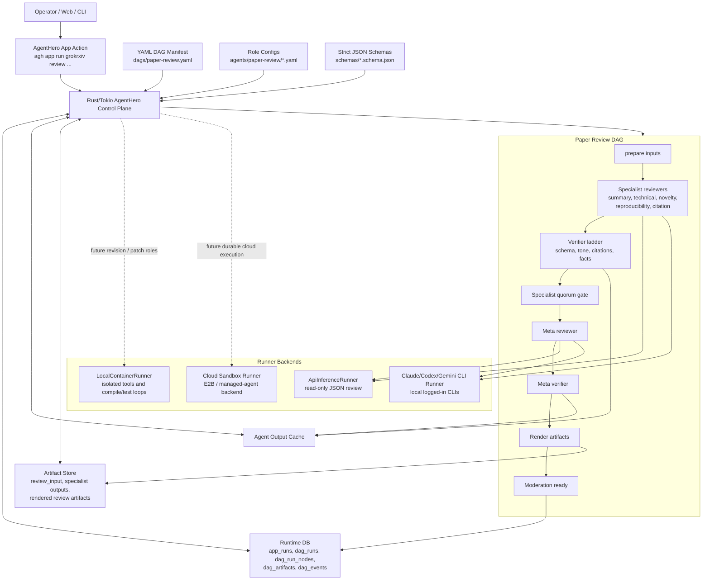

# Agent Orchestration Recommendations

Date: 2026-06-08

## Context

The transcribed workshop, "Beyond the basics with Claude Code," is about moving
from agentic programming to agentic software engineering. Its useful lessons for
GrokRxiv are not "replace the app runtime with Claude-managed agents." They are:

- give agents access to the same operational context humans use: code, design
  docs, Slack/email decisions, CI/CD, dashboards, runbooks, and meeting notes
- manage the context window as a constrained engineering budget
- use extension mechanisms according to what they scale for: always-on project
  rules, on-demand skills, external-service MCP/plugins, lifecycle hooks, and
  isolated subagents
- prefer tight feedback loops over hoping a larger model fixes harness design
- support asynchronous and parallel work with explicit state, summaries,
  ownership, and monitoring

Current online guidance points in the same direction:

- Anthropic's "Building effective agents" distinguishes deterministic workflows
  from autonomous agents and recommends simple, composable patterns before
  heavier frameworks.
- Anthropic's eval guidance treats an agent eval as a full harness evaluation:
  task, tool trajectory, environment outcome, graders, and trace.
- Anthropic's tool guidance recommends a few thoughtful, workflow-matched tools,
  iterated against evals, with clear LLM-facing documentation.
- Claude Code docs frame MCP, skills, hooks, subagents, and agent teams as
  different extension surfaces: MCP for external services, skills for reusable
  workflows, hooks for lifecycle automation, and subagents for isolated work.
- OpenAI Agents SDK guidance mirrors the "manager" pattern that GrokRxiv already
  uses: a central controller combines specialist outputs and enforces shared
  guardrails, while tracing records model calls, tools, handoffs, guardrails,
  and custom events.

GrokRxiv should adopt those lessons without moving the durable control plane
into a managed agent product. AgentHero should remain the orchestrator.

## Recommendation

Keep GrokRxiv's orchestration model centered on the Rust/Tokio AgentHero DAGOps
control plane. The orchestrator should own topology, scheduling, concurrency,
cache, persistence, verifier gates, rendering, moderation, publishing, and final
side effects.

Treat Claude, Codex, Gemini, local containers, E2B, and future cloud agent
products as runner backends under AgentHero, not as replacements for AgentHero.

The working rule is:

```text
If a role reads prepared artifacts and returns JSON, use an API or CLI inference runner.
If a role needs files, shell, compilers, generated artifacts, or patch proposals, use an agent runner.
If a role can mutate files or execute untrusted code, run it in an isolated workdir or sandbox.
If a role only needs an external service, prefer a scoped connector/MCP/tool over prompt stuffing.
If a role needs reusable project procedure, use a skill or role config instead of always-on prompt text.
Deterministic AgentHero code validates and applies side effects.
```

For `paper-review`, keep the "manager" topology: AgentHero prepares artifacts,
fan-outs to specialist reviewers, validates outputs, applies quorum policy, and
lets the meta reviewer synthesize typed specialist outputs. Do not switch to a
decentralized handoff model where specialists pass prose state to each other.
That would weaken review reproducibility and make guardrail placement harder.

## Target Architecture



## What GrokRxiv Already Does Well

- The review flow is manifest-driven instead of a single monolithic prompt.
- Specialist and meta-reviewer roles have explicit YAML configs.
- Outputs are strict JSON artifacts validated against role-specific schemas.
- Handoffs are structured: specialist outputs are keyed by role and passed to
  the meta reviewer as a JSON object.
- Verifier gates and quorum logic prevent weak specialist output from silently
  driving final synthesis.
- Rust owns side effects such as DB writes, cache writes, rendering, moderation,
  and publish transitions.
- Runner selection is data-driven enough to support API, CLI, and future
  sandboxed execution backends.
- The current meta-reviewer shape is a good manager pattern: specialists do the
  focused review work, while one synthesizer owns the final verdict and shared
  guardrails.
- The extraction DAG already separates deterministic Rust tool nodes from agent
  judgment nodes, which matches current tool-design guidance.

## Gaps To Close

1. Add an explicit architecture-eval suite.

   Track success rate, verifier pass rate, latency, token usage, cache hit rate,
   runner choice, and quality judgments across fixed regression papers and
   failure-mode papers. Use this before and after changes to prompts, schemas,
   runners, or DAG topology. Treat each eval as a harness run, not just a final
   response check: record the task, environment, node trace, tool calls,
   artifacts, verifier results, and final state.

2. Keep prompts and role configs lean.

   Avoid rebuilding the workshop's 400-line prompt failure mode. Put stable,
   always-needed role identity in the system prompt. Put task-specific policy in
   role configs, overlays, prompt facts, schemas, and deterministic verifier
   inputs. Add a prompt-budget report for every role so prompt growth becomes a
   visible diff.

3. Preserve structured subagent handoffs.

   Do not allow specialist, extraction, or revision agents to communicate by
   prose summaries when the next node needs machine-readable state. Handoffs
   should be named artifacts that validate against strict schemas.

4. Promote deterministic tools before agent tools.

   For extraction, citation resolution, metadata checks, and render validation,
   prefer Rust or other deterministic tool nodes. Use LLM agents for judgment,
   synthesis, ambiguity resolution, and repair proposals. Treat hooks/verifiers
   as the GrokRxiv equivalent of "red squiggles": they should surface targeted
   warnings or block unsafe actions, not replace the main reasoning path.

5. Add sandboxed runners before enabling write-capable agents.

   Future revision agents should work in isolated directories or containers,
   emit structured patch artifacts, attach compile/test evidence, and let
   AgentHero apply accepted side effects after verification and policy gates.

6. Make runner economics observable.

   Persist runner, provider, model, latency, token counts when available, cache
   status, fallback usage, and sandbox references. This keeps API-vs-CLI-vs-cloud
   tradeoffs auditable.

7. Version cache identity by prompt and contract.

   The cache key should include the role config hash, prompt/template hash,
   schema hash, verifier policy hash, model, runner, and input hash. Otherwise a
   prompt or schema change can reuse stale specialist output.

8. Add live run observability.

   Expose a CLI or web "watch" view over `dag_run_nodes`, `dag_events`, and
   artifacts. Operators should see each specialist's state, verifier result,
   retries, latency, cache status, and blocked/error reason without waiting for
   the whole run to finish.

9. Keep MCP/plugins narrowly scoped.

   Use external connectors/MCP for data the local repo cannot provide: Slack
   decisions, email context, dashboards, GitHub/CI state, browser automation, or
   hosted docs. For local developer workflows, prefer direct `agh`/`grokrxiv`
   commands, Rust tool nodes, or role configs. Do not wrap an internal CLI in MCP
   just to call a command AgentHero can already run.

10. Add media/transcript ingestion as a deterministic pipeline, not a reviewer
    prompt trick.

    When GrokRxiv needs talks, demos, or recorded meetings as review context,
    model it as an ingest DAG: fetch captions when available, fall back to
    `yt-dlp` + Whisper/transcription when needed, normalize timestamps into a
    transcript artifact, then summarize or cite against that artifact. Do not
    depend on a UI-only YouTube summary or an implicit browser plugin.

## Near-Term Implementation Order

1. Define an eval matrix for `paper-review` and `paper-extract`.
2. Add prompt/schema/verifier hash dimensions to agent cache identity.
3. Add architecture-level metrics to the existing runtime records or reporting.
4. Add a live run watch view backed by `dag_run_nodes`, `dag_events`, and
   artifact metadata.
5. Review role prompts for always-loaded policy bloat and move task-specific
   material into role configs, prompt facts, or verifier facts.
6. Harden schema-handoff tests for specialist-to-meta and extraction-to-review
   boundaries.
7. Add a transcript/media ingest DAG only when recorded meetings or videos become
   recurring GrokRxiv input.
8. Add a sandbox runner only after a real write-capable revision role needs it.

## Non-Goals

- Do not replace the AgentHero control plane with Claude-managed agents.
- Do not give agents direct production DB, publishing, moderation, or canonical
  repo mutation privileges.
- Do not add broad cloud-agent infrastructure for current read-only review
  roles unless evals show the simpler runners cannot meet quality or reliability
  targets.
- Do not treat skills, prompts, or managed-agent features as a substitute for
  strict schemas, verifier gates, and durable runtime state.
- Do not make MCP the default interface for local repo operations that are
  already expressible as deterministic `agh`/`grokrxiv` commands or Rust tool
  nodes.

## Source Grounding

- Workshop transcript generated locally from
  `https://www.youtube.com/watch?v=tuY2ChJIx48` with `yt-dlp` and Whisper.
- Anthropic, ["Building effective agents"](https://www.anthropic.com/engineering/building-effective-agents):
  workflows are predefined code paths; agents dynamically direct tool use; start
  with simple composable patterns and understand any framework abstraction.
- Anthropic, ["Demystifying evals for AI agents"](https://www.anthropic.com/engineering/demystifying-evals-for-ai-agents):
  agent evals should track tasks, trials, graders, transcripts/traces, and final
  environment outcomes.
- Anthropic, ["Writing effective tools for AI agents"](https://www.anthropic.com/engineering/writing-tools-for-agents):
  build a few high-impact, clearly documented tools and iterate them against
  evals.
- Claude Code docs, ["Extend Claude Code"](https://code.claude.com/docs/en/features-overview):
  CLAUDE.md, skills, MCP, subagents, hooks, and plugins solve different context
  and automation problems.
- Claude Code docs, ["Create custom subagents"](https://code.claude.com/docs/en/sub-agents):
  subagents are useful for isolated, verbose, self-contained work but need clear
  summaries and context management.
- OpenAI Developers, ["Codex use cases"](https://developers.openai.com/codex/use-cases):
  Codex workflows include creating CLIs agents can use, saving repeatable
  workflows as skills, adding evals, and keeping documentation up to date.
- OpenAI Agents SDK, ["Agent orchestration"](https://openai.github.io/openai-agents-js/guides/multi-agent/):
  use manager-style "agents as tools" when one controller should combine
  specialist outputs and enforce shared guardrails.
- OpenAI Agents SDK, ["Tracing"](https://openai.github.io/openai-agents-python/tracing/):
  production agent systems should trace model generations, tools, handoffs,
  guardrails, and custom events.
- Model Context Protocol, ["Sampling"](https://modelcontextprotocol.io/specification/draft/client/sampling):
  MCP can enable nested model calls, but clients should retain control over
  model access, selection, permissions, and human approval.
