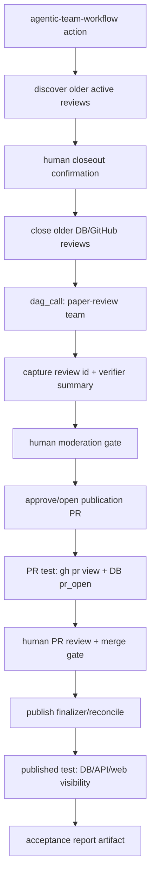

# GrokRxiv Agentic Team Workflow Implementation Plan

> **For agentic workers:** REQUIRED SUB-SKILL: Use superpowers:subagent-driven-development (recommended) or superpowers:executing-plans to implement this plan task-by-task. Steps use checkbox (`- [ ]`) syntax for tracking.

**Goal:** Build, test, and git-commit a runnable AgentHero app DAG called the **GrokRxiv Agentic Team Workflow** that closes older active reviews, runs the GrokRxiv review team on `https://arxiv.org/abs/2606.00799`, pauses for human moderation, opens a publication PR only after approval, pauses for human PR review/merge, verifies publication, and records a reproducible acceptance artifact.

**Architecture:** AgentHero remains the Rust/Tokio DAGOps platform and owns app actions, DAG execution, node state, worker dispatch, and human-gate checkpoints. GrokRxiv owns the app-specific workflow contracts under `agenthero/apps/grokrxiv/`: the DAG manifest, app action, app-owned Rust handlers, schemas, prompts if needed, and acceptance docs. The workflow composes the existing `paper-review` and `paper-publish` surfaces instead of adding root commands or a paper-review-specific supervisor branch.

**Tech Stack:** Rust/Tokio, `agenthero-dag-runtime`, `agenthero-dag-executor`, GrokRxiv app adapter, Supabase Postgres via `sqlx`, GitHub REST via existing publisher crate, YAML DAG manifests, JSON Schema, CLI provider runners (`runner: cli`, Gemini where existing role configs use Gemini), `agh app run grokrxiv ...` acceptance commands.

---

## Current Baseline

- Repository root: `/Users/mlong/Documents/Development/grokrxiv`
- Checkpoint before this plan: `9fb6bfe docs: reframe formal verification plan as a GrokRxiv workflow on the AgentHero platform`
- Current branch state at plan creation: `main` is ahead of `origin/main`; this plan is a new artifact and does not overwrite the committed formal-verification plan.
- Test target verified from arXiv: `2606.00799`, title `Weyl-type theorems in Galilei and Carroll geometry`, submitted `2026-05-30`, authors Philip K. Schwartz, James Read, Quentin Vigneron.
- Existing app actions to compose:
  - `agh app run grokrxiv review <URL_OR_PATH> --type arxiv`
  - `agh app run grokrxiv approve <REVIEW_ID>`
  - `agh app run grokrxiv request-revisions <REVIEW_ID> --notes <TEXT>`
  - `agh app run grokrxiv close <REVIEW_ID> --reason <TEXT>`
  - `agh app run grokrxiv list reviews --review-status <STATUS>`
- Current DB terminal state for "closed/done" reviews is `withdrawn`; there is no `closed` or `done` review status in the current review status constraint.

## Product Boundary

This is an AgentHero platform workflow, not a separate GrokRxiv-only automation script.

- AgentHero owns: action registration, DAG loading, execution ordering, node status, future worker placement, artifacts, runtime state, and human-gate resume semantics.
- GrokRxiv owns: review team roles, source-specific closeout policy, publish policy, GitHub PR comments, public review verification, and app-specific schemas.
- External agent products are runner backends only. `antigravity` is not part of this workflow unless a future, explicit provider path is added separately. The existing Gemini role configs stay on Gemini.
- Human approval is a DAG output and resume requirement. The workflow must never auto-merge a GitHub PR or publish public output without an explicit human step.

## Agent Teams

### Development Teams

Use these teams to execute the plan. Each team works through AgentHero-owned boundaries and commits its slice before handoff.

- **Team A: Platform Workflow Runtime**
  - Adds the new app action, makes the GrokRxiv adapter execute this manifest, and keeps the runtime reusable for future AgentHero app DAGs.
- **Team B: Review Closeout + State Team**
  - Implements dry-run and apply modes for older active review closeout. Database state becomes `withdrawn`; GitHub PRs are closed with an explanatory comment.
- **Team C: GrokRxiv Review Team**
  - Composes the existing `paper-review` team and captures the produced `review_id`, verifier status, moderation status, and artifacts.
- **Team D: Human Loop + Publisher Team**
  - Implements moderation and PR gates, opens a publication PR only after human approval, and verifies publication after human merge.
- **Team E: Acceptance + Documentation Team**
  - Adds simulated tests, a live acceptance runbook, and the committed acceptance artifact for `2606.00799`.
- **Team F: Integrator**
  - Runs the required verification matrix, resolves cross-team integration issues, and makes the final git commit.

### Runtime Teams

The workflow DAG treats the existing GrokRxiv roles as an AgentHero-managed team:

- **Specialist review agents:** `summary`, `technical_correctness`, `novelty`, `reproducibility`, `citation`.
- **Verifier tools:** JSON schema, citation existence, tone, metadata, and review gate verifiers already wired into the paper-review DAG.
- **Meta reviewer:** synthesizes specialist outputs after `specialist_quorum`.
- **Deterministic publisher tools:** render/upload/open PR/close PR/status verification.
- **Human operators:** moderator approval and GitHub PR merge are explicit gates.

## DAG Shape



## Planned File Map

- Create: `agenthero/apps/grokrxiv/dags/grokrxiv-agentic-team-workflow.yaml`
  - App DAG manifest for closeout, review, human gates, PR test, publish test, and acceptance report.
- Modify: `agenthero/apps/grokrxiv/app.yaml`
  - Add `agentic-team-workflow` app action mapped to `grokrxiv-agentic-team-workflow`.
- Create: `agenthero/apps/grokrxiv/schemas/agentic_team_workflow_report.schema.json`
  - Strict report contract for closeout candidates, review id, PR URL, human gates, publication checks, and acceptance status.
- Create: `agenthero/apps/grokrxiv/crates/orchestrator/src/agentic_team_workflow.rs`
  - App-owned Rust handlers for workflow input normalization, closeout discovery/apply, human-gate outputs, PR checks, publication checks, and report rendering.
- Modify: `agenthero/apps/grokrxiv/crates/orchestrator/src/lib.rs`
  - Expose `agentic_team_workflow`.
- Modify: `agenthero/apps/grokrxiv/crates/orchestrator/src/dag_tools.rs`
  - Register app-owned handler names for manifest validation.
- Modify: `agenthero/apps/grokrxiv/rust/src/main.rs`
  - Route `agentic-team-workflow` through manifest execution with a real GrokRxiv node handler instead of the manifest-only smoke handler.
- Modify: `crates/orchestrator/tests/agenthero_cli_contract.rs`
  - Add CLI contract test for the new app action.
- Add tests:
  - `agenthero/apps/grokrxiv/crates/orchestrator/tests/agentic_team_workflow.rs`
  - Extend existing manifest/app-registry tests if they already load all GrokRxiv DAGs.
- Create: `agenthero/apps/grokrxiv/docs/agentic-team-workflow.md`
  - Operator runbook for dry-run, closeout apply, moderation approval, PR merge, final publication verification.
- Create after live run: `agenthero/apps/grokrxiv/tests/manual/agentic-team-workflow-2606.00799.json`
  - Committed acceptance artifact.

---

### Task 1: Add Strict Workflow Report Schema

**Files:**
- Create: `agenthero/apps/grokrxiv/schemas/agentic_team_workflow_report.schema.json`
- Test: `agenthero/apps/grokrxiv/crates/orchestrator/tests/agentic_team_workflow.rs`

- [ ] **Step 1: Write the failing schema fixture test**

Create `agenthero/apps/grokrxiv/crates/orchestrator/tests/agentic_team_workflow.rs`:

```rust
use serde_json::json;

#[test]
fn agentic_team_workflow_report_schema_accepts_waiting_for_human() {
    let schema_text = std::fs::read_to_string(
        "../../schemas/agentic_team_workflow_report.schema.json",
    )
    .expect("schema file exists");
    let schema_json: serde_json::Value = serde_json::from_str(&schema_text).expect("schema json");
    let schema = jsonschema::JSONSchema::compile(&schema_json).expect("schema compiles");

    let report = json!({
        "workflow": "grokrxiv-agentic-team-workflow",
        "source": "https://arxiv.org/abs/2606.00799",
        "arxiv_id": "2606.00799",
        "status": "waiting_for_human",
        "closeout": {
            "mode": "dry_run",
            "candidates": [],
            "closed": [],
            "skipped": []
        },
        "review": {
            "review_id": null,
            "review_status": null,
            "verifier_status": null,
            "review_url": null
        },
        "human_gates": [
            {
                "gate": "moderation",
                "status": "waiting",
                "resume_command": "agh app run grokrxiv agentic-team-workflow https://arxiv.org/abs/2606.00799 --review-id <REVIEW_ID> --human-approved-review"
            }
        ],
        "github": {
            "pr_url": null,
            "pr_state": null,
            "merged": false
        },
        "publication": {
            "db_status": null,
            "public_api_ok": false,
            "web_ok": false
        },
        "acceptance": {
            "published_test": false,
            "pr_test": false,
            "human_loop_test": true
        }
    });

    let errors: Vec<_> = schema.validate(&report).err().into_iter().flatten().collect();
    assert!(errors.is_empty(), "{errors:#?}");
}
```

- [ ] **Step 2: Run the failing test**

Run:

```bash
cargo test --manifest-path agenthero/apps/grokrxiv/Cargo.toml --test agentic_team_workflow agentic_team_workflow_report_schema_accepts_waiting_for_human
```

Expected: FAIL because `agentic_team_workflow_report.schema.json` does not exist.

- [ ] **Step 3: Add the schema**

Create `agenthero/apps/grokrxiv/schemas/agentic_team_workflow_report.schema.json`:

```json
{
  "$schema": "https://json-schema.org/draft/2020-12/schema",
  "title": "GrokRxiv Agentic Team Workflow Report",
  "type": "object",
  "additionalProperties": false,
  "required": [
    "workflow",
    "source",
    "arxiv_id",
    "status",
    "closeout",
    "review",
    "human_gates",
    "github",
    "publication",
    "acceptance"
  ],
  "properties": {
    "workflow": { "const": "grokrxiv-agentic-team-workflow" },
    "source": { "type": "string", "minLength": 1 },
    "arxiv_id": { "type": "string", "pattern": "^[0-9]{4}\\.[0-9]{4,5}$" },
    "status": {
      "type": "string",
      "enum": ["dry_run", "running", "waiting_for_human", "pr_open", "published", "failed"]
    },
    "closeout": {
      "type": "object",
      "additionalProperties": false,
      "required": ["mode", "candidates", "closed", "skipped"],
      "properties": {
        "mode": { "type": "string", "enum": ["dry_run", "apply"] },
        "candidates": { "$ref": "#/$defs/review_list" },
        "closed": { "$ref": "#/$defs/review_list" },
        "skipped": { "$ref": "#/$defs/review_list" }
      }
    },
    "review": {
      "type": "object",
      "additionalProperties": false,
      "required": ["review_id", "review_status", "verifier_status", "review_url"],
      "properties": {
        "review_id": { "type": ["string", "null"], "format": "uuid" },
        "review_status": {
          "type": ["string", "null"],
          "enum": [null, "draft", "in_review", "awaiting_moderation", "pr_open", "published", "corrected", "withdrawn", "rejected", "system_failed"]
        },
        "verifier_status": {
          "type": ["string", "null"],
          "enum": [null, "pass", "warn", "fail"]
        },
        "review_url": { "type": ["string", "null"] }
      }
    },
    "human_gates": {
      "type": "array",
      "items": { "$ref": "#/$defs/human_gate" }
    },
    "github": {
      "type": "object",
      "additionalProperties": false,
      "required": ["pr_url", "pr_state", "merged"],
      "properties": {
        "pr_url": { "type": ["string", "null"] },
        "pr_state": { "type": ["string", "null"], "enum": [null, "open", "closed", "merged"] },
        "merged": { "type": "boolean" }
      }
    },
    "publication": {
      "type": "object",
      "additionalProperties": false,
      "required": ["db_status", "public_api_ok", "web_ok"],
      "properties": {
        "db_status": {
          "type": ["string", "null"],
          "enum": [null, "pr_open", "published", "corrected", "withdrawn", "rejected"]
        },
        "public_api_ok": { "type": "boolean" },
        "web_ok": { "type": "boolean" }
      }
    },
    "acceptance": {
      "type": "object",
      "additionalProperties": false,
      "required": ["published_test", "pr_test", "human_loop_test"],
      "properties": {
        "published_test": { "type": "boolean" },
        "pr_test": { "type": "boolean" },
        "human_loop_test": { "type": "boolean" }
      }
    }
  },
  "$defs": {
    "review_list": {
      "type": "array",
      "items": {
        "type": "object",
        "additionalProperties": false,
        "required": ["review_id", "status", "github_pr_url", "action"],
        "properties": {
          "review_id": { "type": "string", "format": "uuid" },
          "status": { "type": "string" },
          "github_pr_url": { "type": ["string", "null"] },
          "action": { "type": "string", "enum": ["close", "skip"] }
        }
      }
    },
    "human_gate": {
      "type": "object",
      "additionalProperties": false,
      "required": ["gate", "status", "resume_command"],
      "properties": {
        "gate": { "type": "string", "enum": ["closeout", "moderation", "pr_merge"] },
        "status": { "type": "string", "enum": ["waiting", "satisfied", "skipped"] },
        "resume_command": { "type": ["string", "null"] }
      }
    }
  }
}
```

- [ ] **Step 4: Run the test again**

Run:

```bash
cargo test --manifest-path agenthero/apps/grokrxiv/Cargo.toml --test agentic_team_workflow agentic_team_workflow_report_schema_accepts_waiting_for_human
```

Expected: PASS.

- [ ] **Step 5: Commit**

```bash
git add agenthero/apps/grokrxiv/schemas/agentic_team_workflow_report.schema.json agenthero/apps/grokrxiv/crates/orchestrator/tests/agentic_team_workflow.rs
git commit -m "test(grokrxiv): add agentic team workflow report schema"
```

---

### Task 2: Add App Action and DAG Manifest

**Files:**
- Create: `agenthero/apps/grokrxiv/dags/grokrxiv-agentic-team-workflow.yaml`
- Modify: `agenthero/apps/grokrxiv/app.yaml`
- Modify: `crates/orchestrator/tests/agenthero_cli_contract.rs`

- [ ] **Step 1: Add the app action contract test**

Append this assertion to the existing app action catalog test in `crates/orchestrator/tests/agenthero_cli_contract.rs`:

```rust
assert!(
    stdout.contains("agentic-team-workflow"),
    "GrokRxiv app catalog should expose the Agentic Team Workflow action:\n{stdout}"
);
```

If the test uses JSON parsing rather than string search, assert that one returned action has:

```rust
assert_eq!(action["id"], "agentic-team-workflow");
assert_eq!(action["dag_type"], "grokrxiv-agentic-team-workflow");
```

- [ ] **Step 2: Run the failing catalog test**

Run:

```bash
cargo test -p agenthero-orchestrator --test agenthero_cli_contract app_run_catalog
```

Expected: FAIL because `agentic-team-workflow` is not in `app.yaml`.

- [ ] **Step 3: Add the app action**

Add this action to `agenthero/apps/grokrxiv/app.yaml` under `actions:`:

```yaml
  - id: agentic-team-workflow
    command: [agentic-team-workflow]
    dag_type: grokrxiv-agentic-team-workflow
    description: Run the human-gated GrokRxiv Agentic Team Workflow for review, PR, publish, and closeout acceptance.
    options:
      - name: source
        kind: positional
        value_name: ARXIV_ID_OR_URL
        required: true
        description: arXiv id or URL to review through the agentic team workflow.
      - name: --review-id
        kind: flag
        value_name: UUID
        description: Resume an existing workflow from a persisted review id.
      - name: --closeout-old
        kind: flag
        description: Discover older active reviews and include them in the closeout report.
      - name: --apply-closeout
        kind: flag
        description: Apply closeout actions after human confirmation.
      - name: --human-approved-review
        kind: flag
        description: Human moderator approved opening the publication PR.
      - name: --human-merged-pr
        kind: flag
        description: Human reviewer merged the publication PR and requests publication verification.
      - name: --include-published-closeout
        kind: flag
        description: Include published/corrected reviews in closeout candidates; off by default.
      - name: --out
        kind: flag
        value_name: PATH
        description: Optional path for the workflow acceptance report JSON.
```

- [ ] **Step 4: Add the DAG manifest**

Create `agenthero/apps/grokrxiv/dags/grokrxiv-agentic-team-workflow.yaml`:

```yaml
id: grokrxiv-agentic-team-workflow
version: 1
accepts: []
concurrency: 2
tools:
  - id: normalize_workflow_input
    executor: rust
    handler: agentic_team_workflow::normalize_workflow_input
    timeout_secs: 15
  - id: discover_older_reviews
    executor: rust
    handler: agentic_team_workflow::discover_older_reviews
    timeout_secs: 30
  - id: closeout_human_gate
    executor: rust
    handler: agentic_team_workflow::closeout_human_gate
    timeout_secs: 15
  - id: close_older_reviews
    executor: rust
    handler: agentic_team_workflow::close_older_reviews
    timeout_secs: 180
  - id: capture_review_result
    executor: rust
    handler: agentic_team_workflow::capture_review_result
    timeout_secs: 30
  - id: moderation_human_gate
    executor: rust
    handler: agentic_team_workflow::moderation_human_gate
    timeout_secs: 15
  - id: open_publication_pr
    executor: rust
    handler: agentic_team_workflow::open_publication_pr
    timeout_secs: 180
  - id: verify_publication_pr
    executor: rust
    handler: agentic_team_workflow::verify_publication_pr
    timeout_secs: 60
  - id: pr_merge_human_gate
    executor: rust
    handler: agentic_team_workflow::pr_merge_human_gate
    timeout_secs: 15
  - id: verify_published_review
    executor: rust
    handler: agentic_team_workflow::verify_published_review
    timeout_secs: 120
  - id: render_acceptance_report
    executor: rust
    handler: agentic_team_workflow::render_acceptance_report
    timeout_secs: 30
nodes:
  - id: normalize_workflow_input
    kind: tool
    tool: normalize_workflow_input
    inputs: [source, review_id, closeout_old, apply_closeout, human_approved_review, human_merged_pr, include_published_closeout, out]
    outputs: [workflow_input.json]
    required: true
  - id: discover_older_reviews
    kind: tool
    tool: discover_older_reviews
    inputs: [workflow_input.json]
    outputs: [closeout_candidates.json]
    required: true
  - id: closeout_human_gate
    kind: tool
    tool: closeout_human_gate
    inputs: [workflow_input.json, closeout_candidates.json]
    outputs: [closeout_gate.json]
    required: true
  - id: close_older_reviews
    kind: tool
    tool: close_older_reviews
    inputs: [workflow_input.json, closeout_candidates.json, closeout_gate.json]
    outputs: [closeout_report.json]
    required: true
  - id: paper_review_team
    kind: dag_call
    dag_type: paper-review
    inputs: [workflow_input.json]
    outputs: [review_run.json]
    required: true
  - id: capture_review_result
    kind: tool
    tool: capture_review_result
    inputs: [workflow_input.json, review_run.json]
    outputs: [review_result.json]
    required: true
  - id: moderation_human_gate
    kind: tool
    tool: moderation_human_gate
    inputs: [workflow_input.json, review_result.json]
    outputs: [moderation_gate.json]
    required: true
  - id: open_publication_pr
    kind: tool
    tool: open_publication_pr
    inputs: [workflow_input.json, review_result.json, moderation_gate.json]
    outputs: [publish_pr.json]
    required: true
  - id: verify_publication_pr
    kind: tool
    tool: verify_publication_pr
    inputs: [workflow_input.json, review_result.json, publish_pr.json]
    outputs: [pr_test.json]
    required: true
  - id: pr_merge_human_gate
    kind: tool
    tool: pr_merge_human_gate
    inputs: [workflow_input.json, review_result.json, pr_test.json]
    outputs: [pr_merge_gate.json]
    required: true
  - id: verify_published_review
    kind: tool
    tool: verify_published_review
    inputs: [workflow_input.json, review_result.json, pr_merge_gate.json]
    outputs: [published_test.json]
    required: true
  - id: render_acceptance_report
    kind: tool
    tool: render_acceptance_report
    inputs: [workflow_input.json, closeout_report.json, review_result.json, moderation_gate.json, publish_pr.json, pr_test.json, pr_merge_gate.json, published_test.json]
    outputs: [agentic_team_workflow_report.json]
    required: true
edges:
  - from: normalize_workflow_input
    to: discover_older_reviews
  - from: discover_older_reviews
    to: closeout_human_gate
  - from: closeout_human_gate
    to: close_older_reviews
  - from: close_older_reviews
    to: paper_review_team
  - from: paper_review_team
    to: capture_review_result
  - from: capture_review_result
    to: moderation_human_gate
  - from: moderation_human_gate
    to: open_publication_pr
  - from: open_publication_pr
    to: verify_publication_pr
  - from: verify_publication_pr
    to: pr_merge_human_gate
  - from: pr_merge_human_gate
    to: verify_published_review
  - from: verify_published_review
    to: render_acceptance_report
```

- [ ] **Step 5: Validate manifest loading**

Run:

```bash
cargo test -p agenthero-dag-runtime --test manifest grokrxiv_app_manifests_load
```

If the existing test name differs, find it with:

```bash
rg -n "grokrxiv.*dags|paper-review.yaml|citation-validation.yaml" crates/dag-runtime/tests crates/orchestrator/tests
```

Expected after adding the manifest: PASS.

- [ ] **Step 6: Run the catalog test**

Run:

```bash
cargo test -p agenthero-orchestrator --test agenthero_cli_contract app_run_catalog
```

Expected: PASS.

- [ ] **Step 7: Commit**

```bash
git add agenthero/apps/grokrxiv/app.yaml agenthero/apps/grokrxiv/dags/grokrxiv-agentic-team-workflow.yaml crates/orchestrator/tests/agenthero_cli_contract.rs
git commit -m "feat(grokrxiv): add agentic team workflow action and DAG"
```

---

### Task 3: Implement Workflow Runtime Dispatch

**Files:**
- Create: `agenthero/apps/grokrxiv/crates/orchestrator/src/agentic_team_workflow.rs`
- Modify: `agenthero/apps/grokrxiv/crates/orchestrator/src/lib.rs`
- Modify: `agenthero/apps/grokrxiv/crates/orchestrator/src/dag_tools.rs`
- Modify: `agenthero/apps/grokrxiv/rust/src/main.rs`
- Test: `agenthero/apps/grokrxiv/crates/orchestrator/tests/agentic_team_workflow.rs`

- [ ] **Step 1: Add handler registry tests**

Add this test to `agenthero/apps/grokrxiv/crates/orchestrator/src/dag_tools.rs`:

```rust
#[test]
fn registry_contains_agentic_team_workflow_handlers() {
    assert!(is_known_rust_tool_handler("agentic_team_workflow::normalize_workflow_input"));
    assert!(is_known_rust_tool_handler("agentic_team_workflow::discover_older_reviews"));
    assert!(is_known_rust_tool_handler("agentic_team_workflow::close_older_reviews"));
    assert!(is_known_rust_tool_handler("agentic_team_workflow::verify_published_review"));
}
```

- [ ] **Step 2: Run the failing handler test**

Run:

```bash
cargo test --manifest-path agenthero/apps/grokrxiv/Cargo.toml -p grokrxiv-app-runtime dag_tools::tests::registry_contains_agentic_team_workflow_handlers
```

Expected: FAIL because handlers are not registered.

- [ ] **Step 3: Register handler descriptors**

Append these descriptors to `RUST_TOOL_HANDLERS` in `agenthero/apps/grokrxiv/crates/orchestrator/src/dag_tools.rs`:

```rust
RustToolDescriptor {
    handler: "agentic_team_workflow::normalize_workflow_input",
    module: "agentic_team_workflow",
    description: "Normalize CLI/app inputs for the GrokRxiv Agentic Team Workflow.",
},
RustToolDescriptor {
    handler: "agentic_team_workflow::discover_older_reviews",
    module: "agentic_team_workflow",
    description: "Find older active GrokRxiv reviews that should be closed before acceptance.",
},
RustToolDescriptor {
    handler: "agentic_team_workflow::closeout_human_gate",
    module: "agentic_team_workflow",
    description: "Emit or satisfy the human confirmation gate for older review closeout.",
},
RustToolDescriptor {
    handler: "agentic_team_workflow::close_older_reviews",
    module: "agentic_team_workflow",
    description: "Mark older reviews withdrawn and close associated GitHub PRs when confirmed.",
},
RustToolDescriptor {
    handler: "agentic_team_workflow::capture_review_result",
    module: "agentic_team_workflow",
    description: "Capture persisted review id, status, URL, and verifier summary from the paper-review team run.",
},
RustToolDescriptor {
    handler: "agentic_team_workflow::moderation_human_gate",
    module: "agentic_team_workflow",
    description: "Emit or satisfy the human moderation approval gate before publication PR creation.",
},
RustToolDescriptor {
    handler: "agentic_team_workflow::open_publication_pr",
    module: "agentic_team_workflow",
    description: "Open the publication PR through the existing GrokRxiv approve path after human approval.",
},
RustToolDescriptor {
    handler: "agentic_team_workflow::verify_publication_pr",
    module: "agentic_team_workflow",
    description: "Verify that the publication PR exists and the review is in pr_open state.",
},
RustToolDescriptor {
    handler: "agentic_team_workflow::pr_merge_human_gate",
    module: "agentic_team_workflow",
    description: "Emit or satisfy the human PR merge gate before publication verification.",
},
RustToolDescriptor {
    handler: "agentic_team_workflow::verify_published_review",
    module: "agentic_team_workflow",
    description: "Verify DB/API/web visibility after the publication PR has been merged.",
},
RustToolDescriptor {
    handler: "agentic_team_workflow::render_acceptance_report",
    module: "agentic_team_workflow",
    description: "Render the final strict JSON acceptance report for the workflow.",
},
```

- [ ] **Step 4: Add a minimal module skeleton**

Create `agenthero/apps/grokrxiv/crates/orchestrator/src/agentic_team_workflow.rs`:

```rust
use agenthero_dag_executor::{DagIo, NodeExecutionResult};
use anyhow::{Context, Result};
use serde::{Deserialize, Serialize};
use serde_json::json;
use uuid::Uuid;

#[derive(Debug, Clone, Deserialize)]
pub struct WorkflowInput {
    pub source: String,
    pub arxiv_id: String,
    pub review_id: Option<Uuid>,
    pub closeout_old: bool,
    pub apply_closeout: bool,
    pub human_approved_review: bool,
    pub human_merged_pr: bool,
    pub include_published_closeout: bool,
    pub out: Option<String>,
}

#[derive(Debug, Clone, Serialize)]
pub struct ReviewCloseoutCandidate {
    pub review_id: Uuid,
    pub status: String,
    pub github_pr_url: Option<String>,
    pub action: String,
}

pub fn normalize_workflow_input(inputs: &DagIo) -> Result<NodeExecutionResult> {
    let source = inputs
        .values
        .get("source")
        .and_then(|v| v.as_str())
        .unwrap_or("https://arxiv.org/abs/2606.00799")
        .to_string();
    let arxiv_id = extract_arxiv_id(&source).context("extract arxiv id")?;
    Ok(NodeExecutionResult::ok().with_value(
        "workflow_input.json",
        json!({
            "source": source,
            "arxiv_id": arxiv_id,
            "review_id": inputs.values.get("review_id").cloned().unwrap_or(json!(null)),
            "closeout_old": inputs.values.get("closeout_old").and_then(|v| v.as_bool()).unwrap_or(false),
            "apply_closeout": inputs.values.get("apply_closeout").and_then(|v| v.as_bool()).unwrap_or(false),
            "human_approved_review": inputs.values.get("human_approved_review").and_then(|v| v.as_bool()).unwrap_or(false),
            "human_merged_pr": inputs.values.get("human_merged_pr").and_then(|v| v.as_bool()).unwrap_or(false),
            "include_published_closeout": inputs.values.get("include_published_closeout").and_then(|v| v.as_bool()).unwrap_or(false),
            "out": inputs.values.get("out").cloned().unwrap_or(json!(null))
        }),
    ))
}

pub fn extract_arxiv_id(source: &str) -> Result<String> {
    let trimmed = source.trim();
    if let Some(id) = trimmed.strip_prefix("https://arxiv.org/abs/") {
        return Ok(id.trim_end_matches('/').to_string());
    }
    if let Some(id) = trimmed.strip_prefix("http://arxiv.org/abs/") {
        return Ok(id.trim_end_matches('/').to_string());
    }
    if trimmed.chars().all(|c| c.is_ascii_digit() || c == '.') && trimmed.contains('.') {
        return Ok(trimmed.to_string());
    }
    anyhow::bail!("source is not an arXiv id or arXiv abs URL: {source}");
}

#[cfg(test)]
mod tests {
    use super::*;

    #[test]
    fn extract_arxiv_id_accepts_abs_url() {
        assert_eq!(
            extract_arxiv_id("https://arxiv.org/abs/2606.00799").unwrap(),
            "2606.00799"
        );
    }
}
```

Add to `agenthero/apps/grokrxiv/crates/orchestrator/src/lib.rs`:

```rust
pub mod agentic_team_workflow;
```

- [ ] **Step 5: Add real node dispatch in the app adapter**

Replace the `GrokrxivAdapter` smoke-only path for this DAG in `agenthero/apps/grokrxiv/rust/src/main.rs` with dispatch that handles the new handlers. The first pass only needs `normalize_workflow_input`; remaining handlers are added in later tasks.

```rust
if ctx.manifest.id.as_str() == "grokrxiv-agentic-team-workflow" {
    match ctx.node.tool.as_deref() {
        Some("normalize_workflow_input") => {
            return grokrxiv_app_runtime::agentic_team_workflow::normalize_workflow_input(ctx.inputs);
        }
        _ => {}
    }
}
```

Keep the existing `manifest_node_result(...)` fallback for non-workflow DAG smoke behavior.

- [ ] **Step 6: Route the new action through manifest execution**

In `run()` inside `agenthero/apps/grokrxiv/rust/src/main.rs`, change:

```rust
if request.action == "validate-citations" {
```

to:

```rust
if matches!(request.action.as_str(), "validate-citations" | "agentic-team-workflow") {
```

- [ ] **Step 7: Run focused tests**

Run:

```bash
cargo test --manifest-path agenthero/apps/grokrxiv/Cargo.toml -p grokrxiv-app-runtime agentic_team_workflow
cargo test --manifest-path agenthero/apps/grokrxiv/rust/Cargo.toml
```

Expected: PASS.

- [ ] **Step 8: Commit**

```bash
git add agenthero/apps/grokrxiv/crates/orchestrator/src/agentic_team_workflow.rs agenthero/apps/grokrxiv/crates/orchestrator/src/lib.rs agenthero/apps/grokrxiv/crates/orchestrator/src/dag_tools.rs agenthero/apps/grokrxiv/rust/src/main.rs
git commit -m "feat(grokrxiv): execute agentic team workflow manifest"
```

---

### Task 4: Implement Older Review Closeout

**Files:**
- Modify: `agenthero/apps/grokrxiv/crates/orchestrator/src/agentic_team_workflow.rs`
- Test: `agenthero/apps/grokrxiv/crates/orchestrator/tests/agentic_team_workflow.rs`

- [ ] **Step 1: Add candidate selection tests**

Add tests that assert:

```rust
#[test]
fn closeout_defaults_to_active_non_public_statuses() {
    let statuses = closeout_candidate_statuses(false);
    assert_eq!(
        statuses,
        vec!["draft", "in_review", "awaiting_moderation", "pr_open"]
    );
}

#[test]
fn closeout_can_include_published_only_when_explicit() {
    let statuses = closeout_candidate_statuses(true);
    assert!(statuses.contains(&"published"));
    assert!(statuses.contains(&"corrected"));
}
```

- [ ] **Step 2: Implement status selection**

Add:

```rust
pub fn closeout_candidate_statuses(include_published: bool) -> Vec<&'static str> {
    let mut statuses = vec!["draft", "in_review", "awaiting_moderation", "pr_open"];
    if include_published {
        statuses.push("published");
        statuses.push("corrected");
    }
    statuses
}
```

- [ ] **Step 3: Implement discovery query**

Add async discovery that excludes the target arXiv id and returns candidates sorted oldest first:

```sql
select r.id, r.status, r.github_pr_url
from reviews r
join papers p on p.id = r.paper_id
where r.status = any($1)
  and coalesce(p.arxiv_id, '') <> $2
order by r.created_at asc
limit $3
```

Use the existing repo `.env` runtime config path through `Config::from_env()` and `AppState::from_config(config).await?`; do not infer missing GitHub/Supabase tokens from the shell alone.

- [ ] **Step 4: Implement closeout dry-run and apply behavior**

Rules:

- If `closeout_old` is false, return no candidates and no mutations.
- If `closeout_old` is true and `apply_closeout` is false, return candidates and `status: waiting_for_human`.
- If `apply_closeout` is true, close each candidate using the existing `close` semantics:
  - DB status becomes `withdrawn`.
  - If `github_pr_url` is a real GitHub PR URL and `--keep-github-pr` is not set, close the PR with a comment.
  - Missing, simulated, or already-closed PRs are reported in `skipped`.
- The reason string is exactly:

```text
Superseded by GrokRxiv Agentic Team Workflow acceptance run for arXiv:2606.00799.
```

- [ ] **Step 5: Run tests**

Run:

```bash
cargo test --manifest-path agenthero/apps/grokrxiv/Cargo.toml --test agentic_team_workflow closeout
```

Expected: PASS.

- [ ] **Step 6: Commit**

```bash
git add agenthero/apps/grokrxiv/crates/orchestrator/src/agentic_team_workflow.rs agenthero/apps/grokrxiv/crates/orchestrator/tests/agentic_team_workflow.rs
git commit -m "feat(grokrxiv): close older reviews in agentic team workflow"
```

---

### Task 5: Compose Paper Review Team and Capture Review Result

**Files:**
- Modify: `agenthero/apps/grokrxiv/rust/src/main.rs`
- Modify: `agenthero/apps/grokrxiv/crates/orchestrator/src/agentic_team_workflow.rs`
- Test: `agenthero/apps/grokrxiv/crates/orchestrator/tests/agentic_team_workflow.rs`

- [ ] **Step 1: Add a review-result parser test**

Test that stdout from the existing app runtime review action yields a review id:

```rust
#[test]
fn parse_review_action_stdout_extracts_review_id() {
    let stdout = r#"{"review_id":"11111111-1111-1111-1111-111111111111","status":"awaiting_moderation"}"#;
    let parsed = parse_review_action_stdout(stdout).unwrap();
    assert_eq!(parsed.review_id.to_string(), "11111111-1111-1111-1111-111111111111");
    assert_eq!(parsed.review_status.as_deref(), Some("awaiting_moderation"));
}
```

- [ ] **Step 2: Implement review-team dag_call dispatch**

For `paper_review_team`, call the existing app runtime action equivalent to:

```bash
agh app run grokrxiv review https://arxiv.org/abs/2606.00799 --type arxiv
```

Inside the app adapter, this should reuse the same runtime binary path used by other GrokRxiv app actions, not shell out to a root command.

- [ ] **Step 3: Implement `capture_review_result`**

Return:

```json
{
  "review_id": "<uuid>",
  "review_status": "awaiting_moderation",
  "verifier_status": "pass|warn|fail|null",
  "review_url": "<canonical app URL or null>"
}
```

If `--review-id` is supplied, skip creating a new review and load this information from the database.

- [ ] **Step 4: Run simulated adapter test**

Run:

```bash
cargo test --manifest-path agenthero/apps/grokrxiv/rust/Cargo.toml agentic_team_workflow
```

Expected: PASS with a fixture/simulated review output.

- [ ] **Step 5: Commit**

```bash
git add agenthero/apps/grokrxiv/rust/src/main.rs agenthero/apps/grokrxiv/crates/orchestrator/src/agentic_team_workflow.rs agenthero/apps/grokrxiv/crates/orchestrator/tests/agentic_team_workflow.rs
git commit -m "feat(grokrxiv): compose paper review team in workflow"
```

---

### Task 6: Implement Human Moderation Gate and PR Test

**Files:**
- Modify: `agenthero/apps/grokrxiv/crates/orchestrator/src/agentic_team_workflow.rs`
- Modify: `agenthero/apps/grokrxiv/rust/src/main.rs`
- Test: `agenthero/apps/grokrxiv/crates/orchestrator/tests/agentic_team_workflow.rs`

- [ ] **Step 1: Add gate tests**

```rust
#[test]
fn moderation_gate_waits_without_human_approval() {
    let gate = moderation_gate_output(
        "https://arxiv.org/abs/2606.00799",
        "11111111-1111-1111-1111-111111111111",
        false,
    );
    assert_eq!(gate["status"], "waiting");
    assert!(gate["resume_command"].as_str().unwrap().contains("--human-approved-review"));
}

#[test]
fn moderation_gate_is_satisfied_with_human_approval() {
    let gate = moderation_gate_output(
        "https://arxiv.org/abs/2606.00799",
        "11111111-1111-1111-1111-111111111111",
        true,
    );
    assert_eq!(gate["status"], "satisfied");
}
```

- [ ] **Step 2: Implement moderation gate**

Behavior:

- Without `--human-approved-review`, emit `waiting_for_human` in the report and a resume command.
- With `--human-approved-review`, allow `open_publication_pr`.
- Never open a PR if the review is `system_failed`, `withdrawn`, or `rejected`.

- [ ] **Step 3: Implement PR opening through existing approve path**

Use the existing `approve` implementation rather than duplicating publisher logic. The workflow output must include:

```json
{
  "pr_url": "https://github.com/<owner>/<repo>/pull/<n>",
  "review_status": "pr_open"
}
```

- [ ] **Step 4: Implement PR test**

PR test passes when:

- DB `reviews.status = 'pr_open'`.
- `reviews.github_pr_url` is non-null and not simulated.
- GitHub PR is visible through the configured publisher credentials.

Use `gh pr view` only in the live runbook. Unit tests should use the publisher crate with a mock HTTP server.

- [ ] **Step 5: Run tests**

Run:

```bash
cargo test --manifest-path agenthero/apps/grokrxiv/Cargo.toml --test agentic_team_workflow moderation
cargo test --manifest-path agenthero/apps/grokrxiv/Cargo.toml -p grokrxiv-publisher
```

Expected: PASS.

- [ ] **Step 6: Commit**

```bash
git add agenthero/apps/grokrxiv/crates/orchestrator/src/agentic_team_workflow.rs agenthero/apps/grokrxiv/rust/src/main.rs agenthero/apps/grokrxiv/crates/orchestrator/tests/agentic_team_workflow.rs
git commit -m "feat(grokrxiv): add human-gated publication PR workflow"
```

---

### Task 7: Implement PR Merge Gate and Published Test

**Files:**
- Modify: `agenthero/apps/grokrxiv/crates/orchestrator/src/agentic_team_workflow.rs`
- Test: `agenthero/apps/grokrxiv/crates/orchestrator/tests/agentic_team_workflow.rs`

- [ ] **Step 1: Add PR merge gate tests**

```rust
#[test]
fn pr_merge_gate_waits_until_human_confirms_merge() {
    let gate = pr_merge_gate_output(
        "https://arxiv.org/abs/2606.00799",
        "11111111-1111-1111-1111-111111111111",
        false,
    );
    assert_eq!(gate["status"], "waiting");
    assert!(gate["resume_command"].as_str().unwrap().contains("--human-merged-pr"));
}
```

- [ ] **Step 2: Implement PR merge gate**

Behavior:

- Without `--human-merged-pr`, emit a waiting gate and do not mark publication verified.
- With `--human-merged-pr`, verify GitHub PR state and DB state.
- If webhook finalization has not run, invoke the existing reconcile/finalizer path if one is exposed; otherwise report `waiting_for_human` with the command to run `agh app run grokrxiv show <REVIEW_ID>` after the webhook/reconcile loop catches up.

- [ ] **Step 3: Implement published test**

Published test passes when all conditions are true:

- DB status is `published` or `corrected`.
- Public API can fetch the review.
- Web URL returns a page that is not `Review not found`.

The test target is the review generated from:

```text
https://arxiv.org/abs/2606.00799
```

- [ ] **Step 4: Run tests**

Run:

```bash
cargo test --manifest-path agenthero/apps/grokrxiv/Cargo.toml --test agentic_team_workflow published
```

Expected: PASS.

- [ ] **Step 5: Commit**

```bash
git add agenthero/apps/grokrxiv/crates/orchestrator/src/agentic_team_workflow.rs agenthero/apps/grokrxiv/crates/orchestrator/tests/agentic_team_workflow.rs
git commit -m "feat(grokrxiv): verify human-merged publication"
```

---

### Task 8: Add Operator Runbook and Acceptance Artifact Path

**Files:**
- Create: `agenthero/apps/grokrxiv/docs/agentic-team-workflow.md`
- Create after live run: `agenthero/apps/grokrxiv/tests/manual/agentic-team-workflow-2606.00799.json`

- [ ] **Step 1: Write the runbook**

Create `agenthero/apps/grokrxiv/docs/agentic-team-workflow.md` with these commands:

````markdown
# GrokRxiv Agentic Team Workflow

This workflow is an AgentHero app DAG for GrokRxiv review, human moderation, publication PR, human PR merge, publication verification, and older review closeout.

## Target Acceptance Paper

- arXiv: `2606.00799`
- URL: `https://arxiv.org/abs/2606.00799`
- Title: `Weyl-type theorems in Galilei and Carroll geometry`

## Dry Run

```bash
agh --json app run grokrxiv agentic-team-workflow https://arxiv.org/abs/2606.00799 --closeout-old
```

## Apply Older Review Closeout

Review the closeout candidates first. Then run:

```bash
agh --json app run grokrxiv agentic-team-workflow https://arxiv.org/abs/2606.00799 --closeout-old --apply-closeout
```

The database terminal state is `withdrawn`. GitHub PRs are closed with a comment when `github_pr_url` points to a real PR.

## Run Review Team

```bash
agh --json app run grokrxiv agentic-team-workflow https://arxiv.org/abs/2606.00799 --closeout-old --apply-closeout --out agenthero/apps/grokrxiv/tests/manual/agentic-team-workflow-2606.00799.json
```

Stop when the workflow reports the moderation gate as `waiting`.

## Human Moderation Approval

Inspect the review with:

```bash
agh app run grokrxiv show <REVIEW_ID>
```

If approved:

```bash
agh --json app run grokrxiv agentic-team-workflow https://arxiv.org/abs/2606.00799 --review-id <REVIEW_ID> --human-approved-review --out agenthero/apps/grokrxiv/tests/manual/agentic-team-workflow-2606.00799.json
```

This opens the publication PR and runs the PR test.

## Human PR Review and Merge

Inspect the PR:

```bash
gh pr view <PR_URL> --json number,state,mergedAt,url,title
```

After a human merges the PR:

```bash
agh --json app run grokrxiv agentic-team-workflow https://arxiv.org/abs/2606.00799 --review-id <REVIEW_ID> --human-approved-review --human-merged-pr --out agenthero/apps/grokrxiv/tests/manual/agentic-team-workflow-2606.00799.json
```

This runs the published test and writes the final acceptance artifact.
````

- [ ] **Step 2: Run docs grep checks**

Run:

```bash
rg -n "2606\\.00799|agentic-team-workflow|human-approved-review|human-merged-pr|withdrawn" agenthero/apps/grokrxiv/docs/agentic-team-workflow.md
```

Expected: all terms are present.

- [ ] **Step 3: Commit**

```bash
git add agenthero/apps/grokrxiv/docs/agentic-team-workflow.md
git commit -m "docs(grokrxiv): document agentic team workflow runbook"
```

---

### Task 9: Verification Matrix

**Files:**
- No new files unless tests require fixture updates.

- [ ] **Step 1: Format**

Run:

```bash
cargo fmt --check
```

Expected: PASS.

- [ ] **Step 2: Platform DAG tests**

Run:

```bash
cargo test -p agenthero-dag-runtime --test manifest
cargo test -p agenthero-dag-executor
cargo test -p agenthero-orchestrator --test dag_app_registry
cargo test -p agenthero-orchestrator --test agenthero_cli_contract
```

Expected: PASS, except any pre-existing root `research/` boundary failure must be fixed or explicitly split into a separate hygiene commit before calling this plan done.

- [ ] **Step 3: GrokRxiv workspace checks**

Run:

```bash
cargo check --manifest-path agenthero/apps/grokrxiv/Cargo.toml --workspace
cargo test --manifest-path agenthero/apps/grokrxiv/Cargo.toml --test agentic_team_workflow
cargo test --manifest-path agenthero/apps/grokrxiv/Cargo.toml -p grokrxiv-publisher
cargo test --manifest-path agenthero/apps/grokrxiv/rust/Cargo.toml
```

Expected: PASS.

- [ ] **Step 4: App catalog smoke**

Run:

```bash
cargo run -p agenthero-orchestrator --bin agh -- --json app run grokrxiv
```

Expected: JSON action catalog includes `agentic-team-workflow`.

- [ ] **Step 5: Dry-run DAG smoke**

Run:

```bash
cargo run -p agenthero-orchestrator --bin agh -- --json app run grokrxiv agentic-team-workflow https://arxiv.org/abs/2606.00799 --closeout-old
```

Expected:

- exit code `0`
- strict report schema validates
- `status` is `waiting_for_human` or `dry_run`
- no database rows are mutated
- no GitHub PRs are closed

- [ ] **Step 6: Commit verification fixes**

If verification required code changes:

```bash
git add <changed-files>
git commit -m "test(grokrxiv): verify agentic team workflow"
```

---

### Task 10: Live Acceptance Run and Final Commit

**Files:**
- Create: `agenthero/apps/grokrxiv/tests/manual/agentic-team-workflow-2606.00799.json`
- Modify only if needed: workflow code or docs discovered during the live run.

- [ ] **Step 1: Dry-run closeout**

Run:

```bash
agh --json app run grokrxiv agentic-team-workflow https://arxiv.org/abs/2606.00799 --closeout-old --out agenthero/apps/grokrxiv/tests/manual/agentic-team-workflow-2606.00799.json
```

Expected: report lists older active reviews. Review candidates before applying.

- [ ] **Step 2: Apply closeout after human confirmation**

Run:

```bash
agh --json app run grokrxiv agentic-team-workflow https://arxiv.org/abs/2606.00799 --closeout-old --apply-closeout --out agenthero/apps/grokrxiv/tests/manual/agentic-team-workflow-2606.00799.json
```

Expected:

- older active DB reviews are `withdrawn`
- older real GitHub PRs are closed with the superseded-by-acceptance-run comment
- target review proceeds or resumes

- [ ] **Step 3: Run or resume review**

If the prior step produced a review id, export it:

```bash
export GROKRXIV_ACCEPTANCE_REVIEW_ID=<REVIEW_ID>
```

If no review id exists, run:

```bash
agh --json app run grokrxiv agentic-team-workflow https://arxiv.org/abs/2606.00799 --closeout-old --apply-closeout --out agenthero/apps/grokrxiv/tests/manual/agentic-team-workflow-2606.00799.json
```

Expected: workflow stops at moderation gate with `human_loop_test: true`.

- [ ] **Step 4: Human approves review**

Run:

```bash
agh app run grokrxiv show "$GROKRXIV_ACCEPTANCE_REVIEW_ID"
```

If the moderator approves, run:

```bash
agh --json app run grokrxiv agentic-team-workflow https://arxiv.org/abs/2606.00799 --review-id "$GROKRXIV_ACCEPTANCE_REVIEW_ID" --human-approved-review --out agenthero/apps/grokrxiv/tests/manual/agentic-team-workflow-2606.00799.json
```

Expected:

- `github.pr_url` is non-null
- `github.pr_state` is `open`
- `acceptance.pr_test` is `true`
- DB status is `pr_open`

- [ ] **Step 5: Human reviews and merges PR**

Run:

```bash
gh pr view <PR_URL> --json number,state,mergedAt,url,title
```

After human merge, run:

```bash
agh --json app run grokrxiv agentic-team-workflow https://arxiv.org/abs/2606.00799 --review-id "$GROKRXIV_ACCEPTANCE_REVIEW_ID" --human-approved-review --human-merged-pr --out agenthero/apps/grokrxiv/tests/manual/agentic-team-workflow-2606.00799.json
```

Expected:

- `github.merged` is `true`
- `publication.db_status` is `published` or `corrected`
- `acceptance.published_test` is `true`
- `acceptance.human_loop_test` is `true`

- [ ] **Step 6: Verify final acceptance artifact**

Run:

```bash
jq '.workflow, .arxiv_id, .status, .acceptance' agenthero/apps/grokrxiv/tests/manual/agentic-team-workflow-2606.00799.json
```

Expected:

```json
"grokrxiv-agentic-team-workflow"
"2606.00799"
"published"
{
  "published_test": true,
  "pr_test": true,
  "human_loop_test": true
}
```

- [ ] **Step 7: Final verification**

Run:

```bash
git status --short
cargo fmt --check
cargo test -p agenthero-dag-runtime --test manifest
cargo test -p agenthero-dag-executor
cargo test -p agenthero-orchestrator --test agenthero_cli_contract
cargo check --manifest-path agenthero/apps/grokrxiv/Cargo.toml --workspace
```

Expected: PASS and only intended files changed.

- [ ] **Step 8: Commit final acceptance artifact**

```bash
git add agenthero/apps/grokrxiv/tests/manual/agentic-team-workflow-2606.00799.json
git commit -m "test(grokrxiv): publish agentic team workflow acceptance run"
```

## Self-Review Checklist

- The workflow is an AgentHero platform DAG, not a root command or one-off GrokRxiv script.
- The plan uses app-scoped commands: `agh app run grokrxiv ...`.
- Human moderation and PR merge are explicit gates.
- Older active DB reviews are terminally marked `withdrawn`; real GitHub PRs are closed with comments.
- The review/PR/publish acceptance target is `https://arxiv.org/abs/2606.00799`.
- The final success definition requires a committed acceptance artifact and passing tests.
